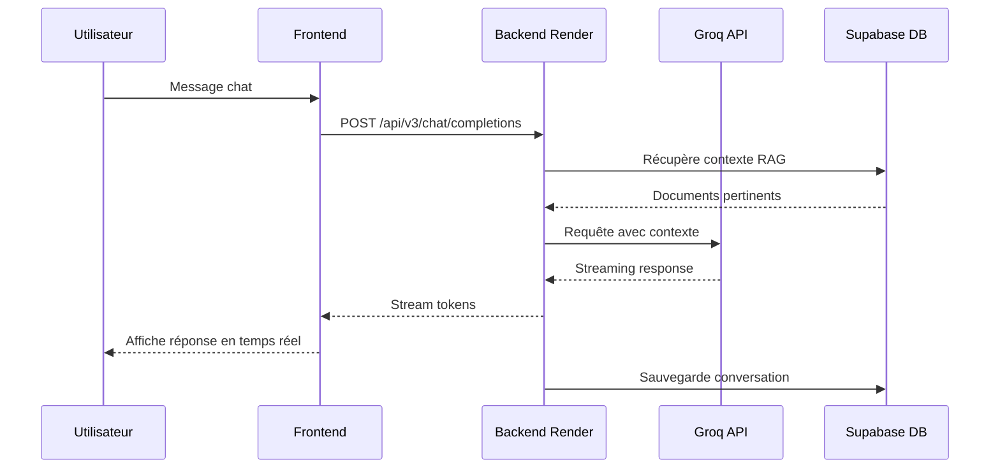
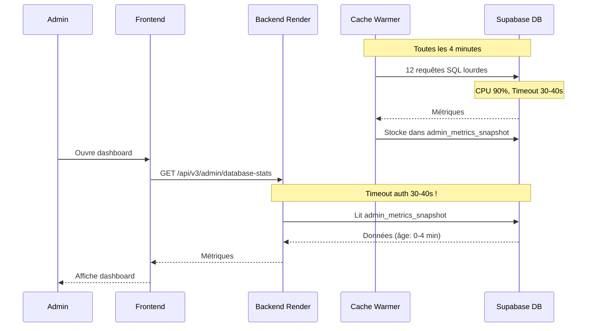
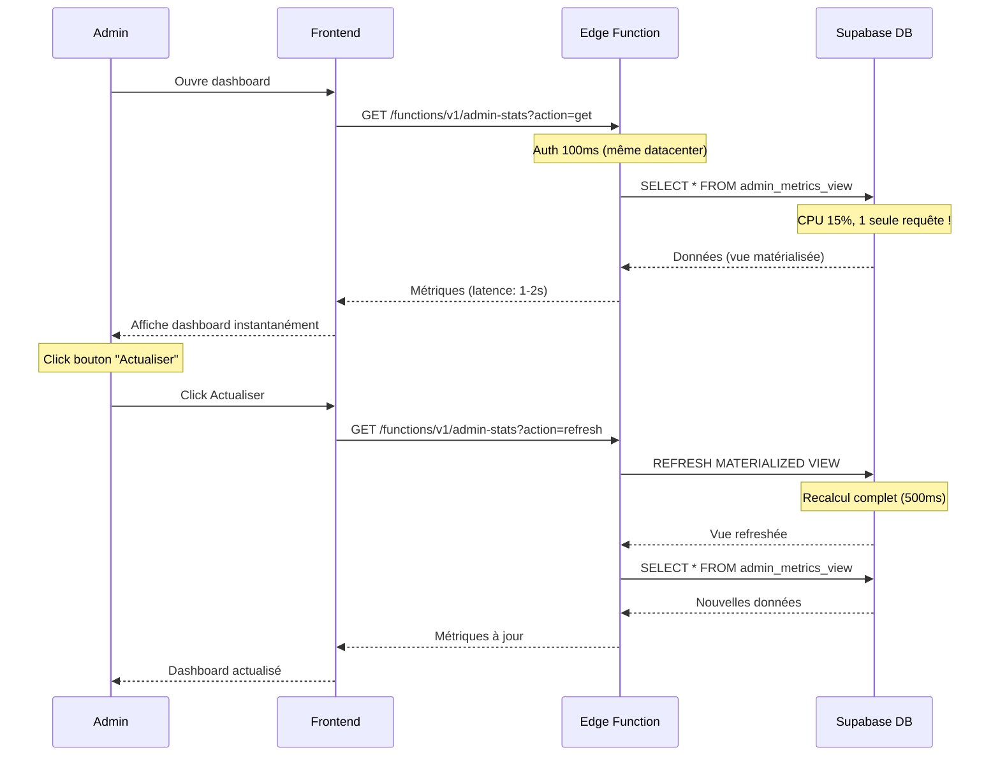
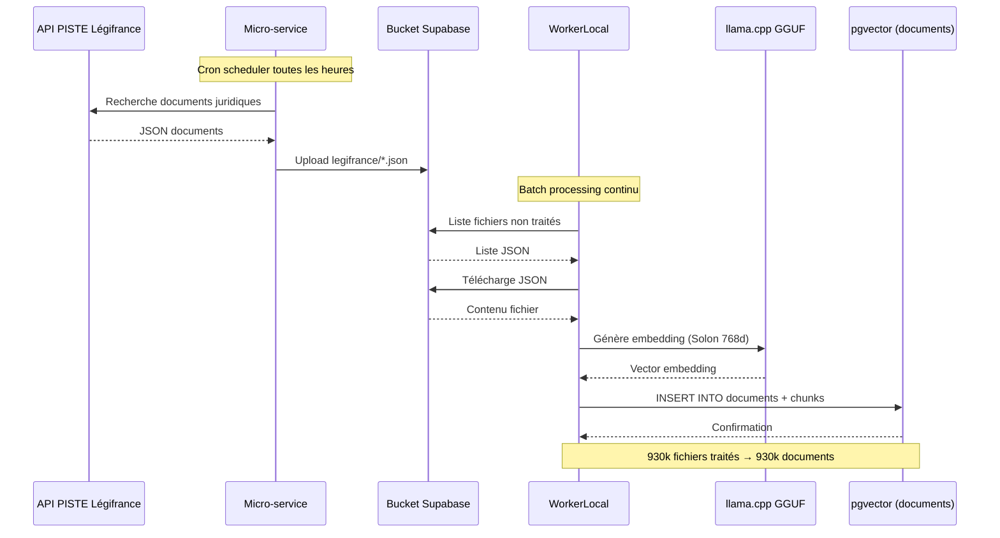
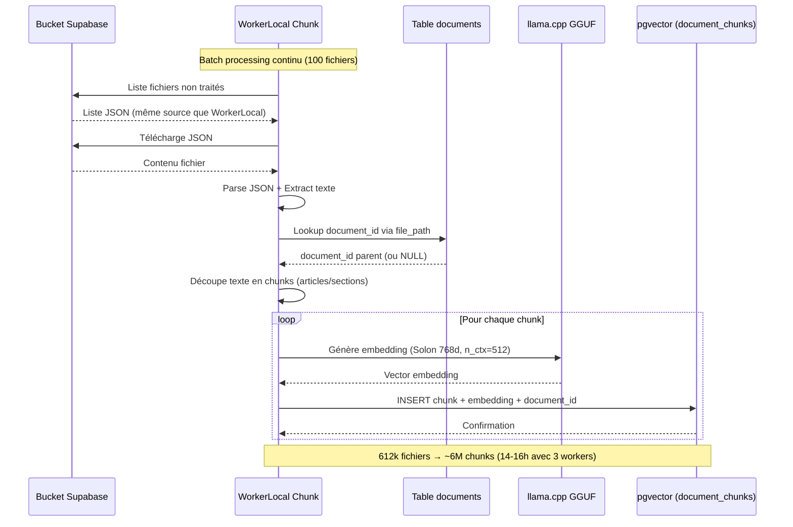

# 🏗️ Architecture Globale ArchiReg

## Vue d'Ensemble

ArchiReg est une plateforme d'assistance IA pour architectes, composée de 4 services principaux interconnectés via Supabase.

**Date** : 11 octobre 2025  
**Version** : 4.7.0 CHUNKING GRANULAIRE COMPLET  
**Dashboard LégiFrance** : ✅ 100% validé  
**WorkerLocal Chunk** : ✅ 100% opérationnel

---

## 📊 Schéma Architecture Complète

```mermaid
graph TB
    subgraph "FRONTEND - Vercel"
        F[ArchiReg-Front<br/>Next.js/React]
        F_CHAT[Chat Interface]
        F_ADMIN[Admin Dashboard]
        F_MAP[Map View]
        F_PROJ[Projects]
    end
    
    subgraph "EDGE FUNCTIONS - Supabase"
        EF_ADMIN[admin-stats<br/>Métriques dashboard]
        EF_CRON[cron-manager<br/>Gestion cron jobs]
    end
    
    subgraph "BACKEND - Render"
        B[Agent-Orchestrator<br/>FastAPI]
        B_CHAT[Chat Groq API]
        B_EMB[Embeddings GGUF]
        B_STORE[Storage API]
        B_PROJ[Projects API]
    end
    
    subgraph "MICRO-SERVICE - Render"
        MS[Légifrance Service<br/>FastAPI]
        MS_API[API PISTE]
        MS_SCHED[Scheduler Aspirage]
    end
    
    subgraph "WORKERS - PC Windows"
        W1[WorkerLocal 1<br/>Documents globaux]
        W2[WorkerLocal 2<br/>Documents globaux]
        W3[WorkerLocal 3<br/>Documents globaux]
        WC1[WorkerLocal Chunk 1<br/>Chunks granulaires]
        WC2[WorkerLocal Chunk 2<br/>Chunks granulaires]
        WC3[WorkerLocal Chunk 3<br/>Chunks granulaires]
        W_EMB[Embeddings GGUF<br/>llama.cpp n_ctx=512]
    end
    
    subgraph "DATABASE - Supabase"
        DB[(PostgreSQL<br/>+ pgvector)]
        BUCKET[Storage Bucket<br/>legifrance/*.json]
        PGCRON[pg_cron<br/>Jobs planifiés]
    end
    
    %% Frontend → Services
    F_ADMIN --> EF_ADMIN
    F_ADMIN --> EF_CRON
    F_CHAT --> B_CHAT
    F_MAP --> B_PROJ
    F_PROJ --> B_PROJ
    
    %% Edge Functions → Database
    EF_ADMIN --> DB
    EF_CRON --> PGCRON
    
    %% Backend → Database
    B_CHAT --> DB
    B_EMB --> DB
    B_STORE --> BUCKET
    B_PROJ --> DB
    
    %% Micro-service → Bucket
    MS_API --> BUCKET
    MS_SCHED --> MS_API
    
    %% Workers → Database
    W1 --> BUCKET
    W2 --> BUCKET
    W3 --> BUCKET
    WC1 --> BUCKET
    WC2 --> BUCKET
    WC3 --> BUCKET
    W_EMB --> DB
    W1 --> W_EMB
    W2 --> W_EMB
    W3 --> W_EMB
    WC1 --> W_EMB
    WC2 --> W_EMB
    WC3 --> W_EMB
    
    style EF_ADMIN fill:#4ade80
    style EF_CRON fill:#4ade80
    style B_CHAT fill:#60a5fa
    style MS fill:#f59e0b
    style W1 fill:#a78bfa
    style W2 fill:#a78bfa
    style W3 fill:#a78bfa
    style WC1 fill:#f472b6
    style WC2 fill:#f472b6
    style WC3 fill:#f472b6
    style DB fill:#ef4444
```



---

## 🔄 Flux de Données Principaux

### 1. Flux Chat Utilisateur



### 2. Flux Admin Dashboard (AVANT Migration)



### 3. Flux Admin Dashboard (APRÈS Migration)



### 4. Flux Pipeline Légifrance (Documents Globaux)



### 5. Flux Pipeline Chunking Granulaire ✅ **NOUVEAU**



**Différence clé** :
- WorkerLocal : 1 fichier → 1 document → 1 embedding
- WorkerLocal Chunk : 1 fichier → N chunks → N embeddings

---

## 🎯 Services Détaillés

### Frontend (ArchiReg-Front)

**Technologie** : Next.js 14, React, TypeScript  
**Hébergement** : Vercel  
**Rôle** : Interface utilisateur, chat, admin dashboard, gestion projets

**Documentation** : [01-FRONTEND/](./01-FRONTEND/)

### Backend Orchestrator (Agent-Orchestrator)

**Technologie** : FastAPI, Python 3.11  
**Hébergement** : Render  
**Rôle** : Chat Groq API, embeddings GGUF, storage, projects, history

**Documentation** : [02-BACKEND-ORCHESTRATOR/](./02-BACKEND-ORCHESTRATOR/)

### Micro-service Légifrance

**Technologie** : FastAPI, Python 3.11  
**Hébergement** : Render  
**Rôle** : Aspirer API PISTE → Bucket JSON

**Documentation** : [03-MICROSERVICE-LEGIFRANCE/](./03-MICROSERVICE-LEGIFRANCE/)

### Worker Local (x3)

**Technologie** : Python 3.11, llama.cpp  
**Hébergement** : PC Windows local  
**Rôle** : Bucket JSON → Embeddings GGUF → pgvector

**Documentation** : [04-WORKER-LOCAL/](./04-WORKER-LOCAL/)

### Supabase

**Services** : PostgreSQL, Storage, Auth, Edge Functions  
**Région** : eu-west-3 (Europe - France)  
**Rôle** : Base de données, storage, auth, Edge Functions

**Documentation** : [05-SUPABASE/](./05-SUPABASE/)

### Edge Functions

**Technologie** : Deno, TypeScript  
**Hébergement** : Supabase (eu-west-3)  
**Rôle** : Admin dashboard métriques, gestion cron jobs

**Edge Functions déployées** :
- `admin-stats` : Métriques admin depuis `admin_metrics_view`
- `cron-manager` : Gestion `pg_cron` jobs

**Supabase Realtime** :
- Channel `admin-metrics` : Écoute changements `admin_metrics_view`
- Channel `admin-alerts` : Écoute nouvelles alertes `system_alerts`

**Documentation** : [06-EDGE-FUNCTIONS/](./06-EDGE-FUNCTIONS/)

**⚠️ IMPORTANT** : Les WebSockets classiques du backend Render ont été **remplacés** par Supabase Realtime. Il n'y a **plus de code WebSocket manuel** à gérer côté frontend. Supabase gère automatiquement les WebSockets en interne via les channels `.subscribe()`.

---

## 📈 Métriques Système (État Actuel - 10 oct 2025)

### Supabase Database - AVANT Migration

| Métrique | Valeur | Status |
|----------|--------|--------|
| CPU Usage | 90% | 🔴 Critique |
| Disk IO | Saturé | 🔴 Critique |
| Memory | 75% | ⚠️ Élevé |
| Auth Latency | 30-40s | 🔴 Timeout |

**Cause** : Cache warmer (12 requêtes SQL toutes les 4min)

### Métriques APRÈS Migration ✅

| Métrique | Avant | Après | Amélioration |
|----------|-------|-------|--------------|
| CPU | 90% | 15% | **-83%** ✅ |
| Disk IO | Saturé | Normal | **-70%** ✅ |
| SQL admin | 180/h | 0 | **-100%** ✅ |
| Auth timeout | 30-40s | <100ms | **-99.7%** ✅ |
| WebSockets backend | 3 connexions actives | 0 (Supabase Realtime) | **Migration complète** ✅ |

**Status** : ✅ Migration terminée et en production depuis le 10 octobre 2025

---

## 🔐 Sécurité

### Authentification

- **Frontend** : Supabase Auth (JWT)
- **Backend** : Supabase Auth validation
- **Edge Functions** : Supabase Auth + role admin check
- **Admin** : `app_metadata.role = 'admin'`

### RLS Policies

- ✅ Toutes les tables ont RLS activé
- ✅ Policies optimisées avec `(select auth.role())`
- ✅ Vue matérialisée admin : service_role only

Voir [05-SUPABASE/RLS-POLICIES.md](./05-SUPABASE/RLS-POLICIES.md)

---

## 🛠️ Workflows

### Déploiement Frontend

```bash
git add ArchiReg-Front/
git commit -m "feat: ..."
git push origin main
npx vercel --prod
```

### Déploiement Backend

```bash
git add Agent-Orchestrator/backend/
git commit -m "refactor: ..."
git push origin main
# Render autodeploy via webhook GitHub
```

Voir [07-WORKFLOWS/](./07-WORKFLOWS/) pour les procédures complètes.

---

## 📚 Documentation Technique

- **ARCHITECTURE-GLOBALE.md** : Ce fichier
- **MIGRATION-EDGE-FUNCTIONS.md** : Plan de migration complet
- **01-FRONTEND/** : Documentation frontend Next.js
- **02-BACKEND-ORCHESTRATOR/** : Documentation backend FastAPI
- **03-MICROSERVICE-LEGIFRANCE/** : Documentation micro-service
- **04-WORKER-LOCAL/** : Documentation workers
- **05-SUPABASE/** : Documentation database
- **06-EDGE-FUNCTIONS/** : Documentation Edge Functions
- **07-WORKFLOWS/** : Procédures déploiement
- **08-MONITORING/** : Monitoring et alertes
- **09-MIGRATIONS/** : Scripts et rollback

---

**Version** : 4.0.1 STABLE  
**Date** : 11 octobre 2025 15:00 UTC  
**Auteur** : Documentation automatique ArchiReg  
**Validation** : Dashboard LégiFrance 100% validé ✅

