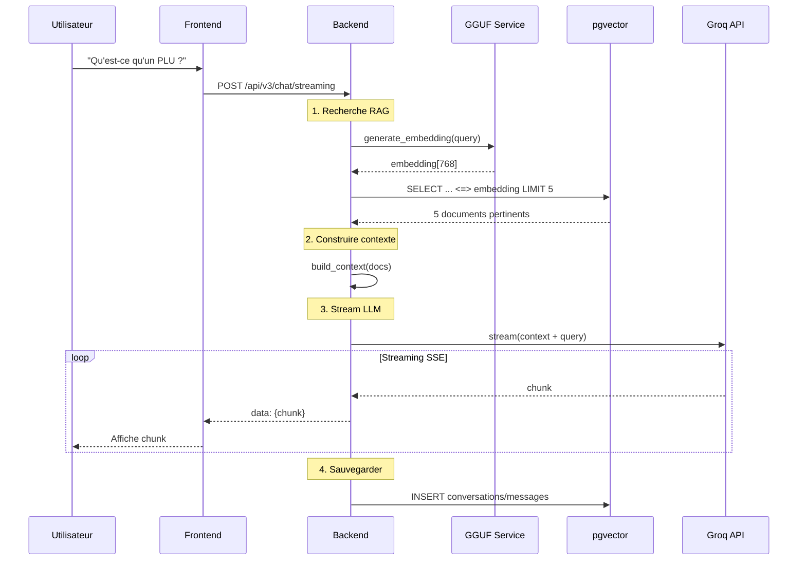
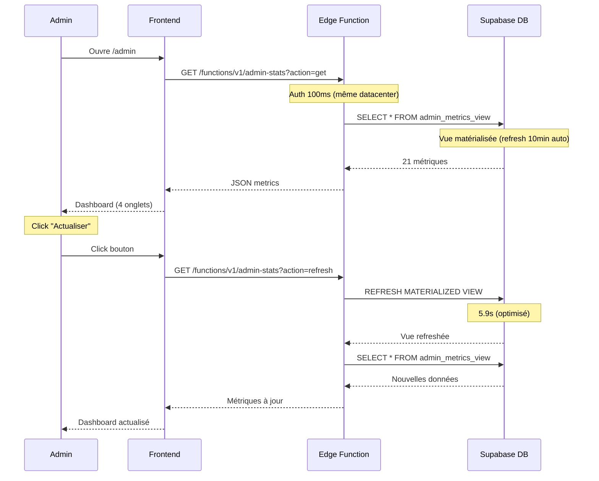
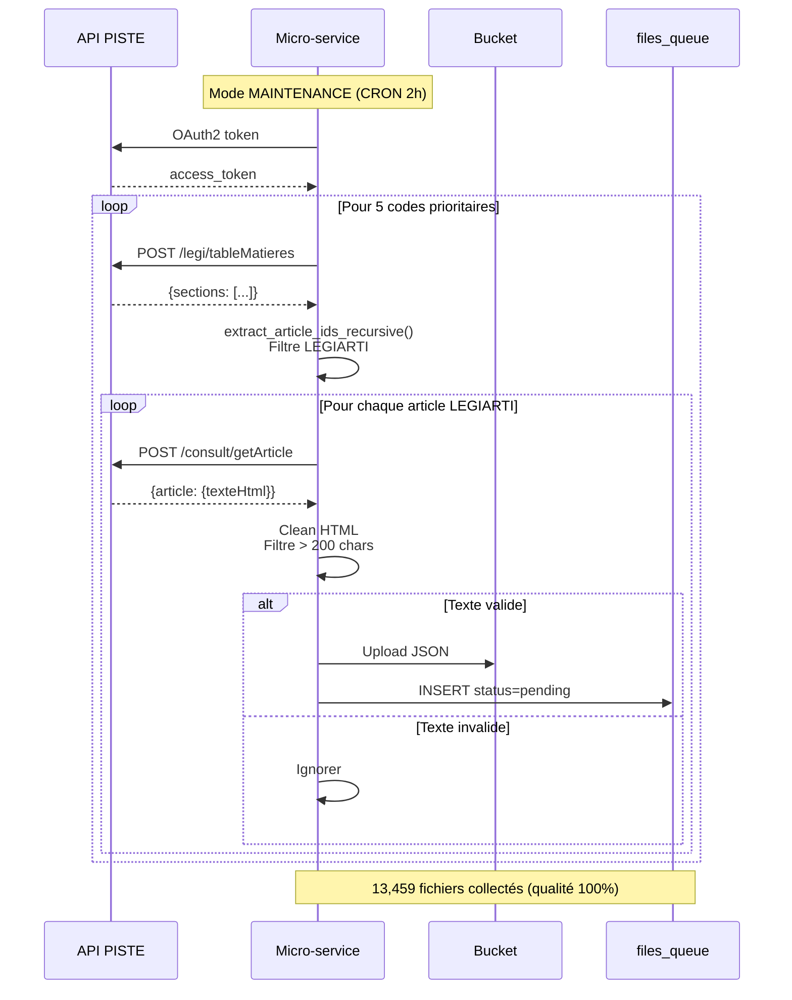
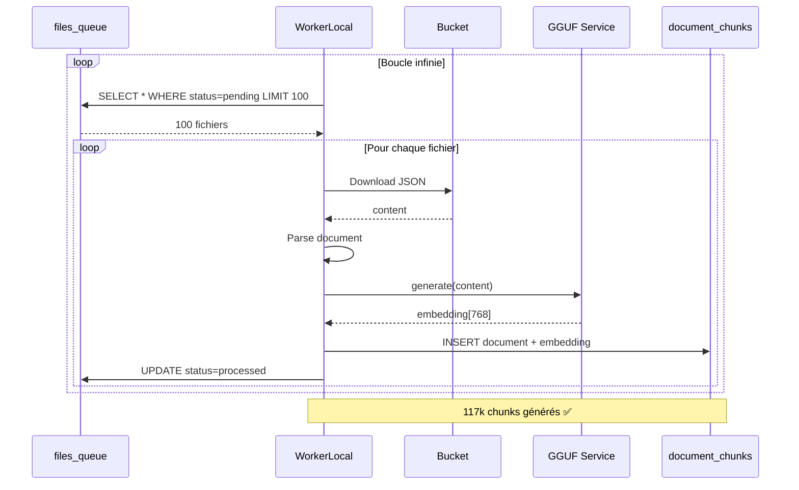

# 🏗️ ARCHITECTURE GLOBALE ARCHIREG

**Date** : 20 octobre 2025  
**Version** : 5.1 CHUNKING v3.0  
**Status** : ✅ EN PRODUCTION

---

## 🎯 VUE D'ENSEMBLE

ArchiReg est une **plateforme RAG (Retrieval-Augmented Generation)** pour l'analyse de documents juridiques (Légifrance).

**Architecture** : 5 services principaux + Supabase

```
Micro-service Légifrance
    ↓ Collecte API PISTE
Bucket Supabase Storage (13,459 fichiers)
    ↓ files_queue
WorkerLocal v3.0 Chunking
    ↓ Parse + LangChain (800/200) + GGUF Embeddings
pgvector document_chunks (117k chunks)
    ↓ HNSW Index (97 MB)
Backend RAG
    ↓ Groq LLM + Streaming
Frontend Chat
```

---

## 📊 SCHÉMA ARCHITECTURE COMPLÈTE

```mermaid
graph TB
    subgraph "1️⃣ COLLECTE DONNÉES"
        MS[Micro-service Légifrance<br/>FastAPI + API PISTE]
        BKT[Bucket Supabase Storage<br/>agentbasic-legifrance-raw<br/>13,459 fichiers]
        FQ[files_queue<br/>13,459 rows]
        
        MS -->|Upload JSON| BKT
        MS -->|INSERT| FQ
    end
    
    subgraph "2️⃣ TRAITEMENT: WORKERLOCAL v3.0"
        WL[WorkerLocal Ultra-Turbo<br/>✅ TERMINÉ<br/>117k chunks]
        
        FQ -->|SELECT pending (100 batch)| WL
        
        WL -->|Parse + LangChain (800/200)| LC[RecursiveCharacterTextSplitter]
        LC -->|~8.7 chunks/fichier| EMB[GGUF Embeddings<br/>768 dims]
        EMB -->|UPSERT idempotent| CHUNKS[document_chunks<br/>117,148 rows<br/>803 MB]
        
        CHUNKS -->|Index HNSW| HNSW[pgvector HNSW<br/>97 MB<br/>m=16, ef=64]
    end
    
    subgraph "3️⃣ BACKEND: RAG + CHAT"
        BE[Backend Agent-Orchestrator<br/>FastAPI + Hypercorn HTTP/2]
        GROQ[Groq API<br/>llama-3.3-70b-versatile]
        GGUF[GGUF Model Local<br/>Solon-embeddings-base<br/>768 dims]
        
        BE -->|READ ONLY| HNSW
        BE -->|Génère embedding query| GGUF
        BE -->|Recherche vectorielle| HNSW
        BE -->|Chat LLM streaming| GROQ
    end
    
    subgraph "4️⃣ FRONTEND + EDGE FUNCTIONS"
        FE[Frontend Next.js<br/>Vercel]
        EDGE[Edge Functions Supabase<br/>admin-stats, cron-manager, system-tests]
        
        FE -->|Chat streaming SSE| BE
        FE -->|Admin métriques| EDGE
        EDGE -->|SELECT admin_metrics_view| HNSW
    end
    
    style MS fill:#f59e0b
    style WL fill:#4ecdc4
    style BE fill:#ff6b6b
    style FE fill:#60a5fa
    style EDGE fill:#4ade80
    style HNSW fill:#ef4444
    style GGUF fill:#ffd93d
    style BKT fill:#ffd93d
```

---

## 🔄 FLUX DE DONNÉES PRINCIPAUX

### **1. Flux Chat Utilisateur** 💬



**Latence** :
- RAG search : <100ms
- Stream TTFB : <500ms
- Total : <1s ✅

---

### **2. Flux Admin Dashboard** 📊



**Performance** :
- Latence Edge : 1-2s
- Auth : <100ms (vs 30-40s avant)
- Gain : -99.7% latence ✅

---

### **3. Flux Collecte Légifrance** 📥



**Modes** :
- **MAINTENANCE** : 5 codes, CRON 2h, ~250 articles/run
- **MASSIVE** : 20 codes, interval 10min, ~1000 articles/run

**Filtres qualité** :
1. ✅ LEGIARTI uniquement (ignore LEGISCTA)
2. ✅ Texte > 200 chars minimum

---

### **4. Flux Workers Global** 🔧



**Performance v3.0** :
- 1 worker ultra-turbo (50 concurrency)
- ~87 fichiers/min
- ~8.7 chunks par fichier
- Taux erreur <0.1%

---

## 🎯 SERVICES DÉTAILLÉS

### **1. Frontend (ArchiReg-Front)** 🎨

**Stack** : Next.js 14 + React 18 + TypeScript  
**Host** : Vercel  
**URL** : https://archi-reg-front.vercel.app

**Features** :
- ✅ Chat streaming SSE + Markdown
- ✅ Dashboard admin (4 onglets, 21 métriques)
- ✅ Tests système (27 tests)
- ✅ Supabase Auth + Realtime

**Doc** : [04-ArchiReg-Front/](./04-ArchiReg-Front/)

---

### **2. Backend (Agent-Orchestrator)** 🤖

**Stack** : FastAPI + Python 3.11 + Hypercorn HTTP/2  
**Host** : Render.com (Starter Plan)  
**URL** : https://agent-orchestrateur-backend.onrender.com

**Responsabilités** :
- ✅ Chat Groq LLM (streaming SSE)
- ✅ RAG pgvector (<100ms)
- ✅ Embeddings GGUF locaux
- ✅ Proxy micro-service Légifrance
- ✅ 9 tests Backend

**Stats** :
- 117k chunks indexés (chunking v3.0)
- Latence RAG <100ms
- Distance min : 0.681
- Résultats seuil 0.7 : 1,155 chunks

**Doc** : [03-Agent-Orchestrator/](./03-Agent-Orchestrator/)

---

### **3. Micro-service Légifrance** 📥

**Stack** : FastAPI + Python 3.11  
**Host** : Render.com (Free tier)  
**URL** : https://micro-service-data-legifrance-piste.onrender.com

**Responsabilités** :
- ✅ Collecte API PISTE Légifrance
- ✅ OAuth2 + Rate limiting (60 req/s)
- ✅ Upload direct bucket Supabase
- ✅ Auto-sync files_queue
- ✅ Persistance état scheduler

**Modes** :
- **MAINTENANCE** (actif) : 5 codes, CRON 2h
- **MASSIVE** : 20 codes, interval 10min

**Filtres qualité** :
- ✅ LEGIARTI uniquement
- ✅ Texte > 200 chars

**Stats** :
- 13,459 fichiers collectés
- Qualité 100% (vs 90% erreurs avant)

**Doc** : [02-Micro-service-Legifrance/](./02-Micro-service-Legifrance/)

---

### **4. WorkerLocal v3.0 Chunking** 🔧

**Stack** : Python 3.11 + llama-cpp-python + LangChain  
**Host** : PC Windows local  

**Responsabilités** :
- ✅ Parse JSON Légifrance
- ✅ Chunking granulaire (LangChain RecursiveCharacterTextSplitter)
- ✅ Génère embeddings par chunk (768 dims)
- ✅ UPSERT idempotent document_chunks + pgvector

**Stats Réelles** :
- ✅ 117,148 chunks générés
- ✅ 13,441 fichiers traités (99.9%)
- ✅ ~87 fichiers/min (50 concurrency)
- ✅ Chunk size : 800 chars, overlap 200
- ✅ Avg chunk : 632 chars
- ✅ Taux erreur <0.1%
- ✅ RAG fonctionnel (distance 0.681)

**Doc** : [05-WorkerLocal/](./05-WorkerLocal/)

---

### **5. Supabase** 🗄️

**Services** : PostgreSQL 17.6 + pgvector + Storage + Auth + Edge Functions  
**Plan** : Pro (25€/mois)  
**Région** : EU Central 1 (Frankfurt)

**Infrastructure** :
- **Database** : 6.7 GB / 100 GB (7% usage)
- **Storage** : 5 GB / 100 GB (5% usage)
- **Compute** : Micro 1GB 2-core ARM
- **Connexions** : 25 / 60 max (42% usage)

**Tables principales** :
- `files_queue` : 13,459 rows (0 pending, tous traités ✅)
- `document_chunks` : 117,148 rows + embeddings (803 MB)
- `parsed_files` : 13,458 rows (tracking)
- `conversations` : 219 rows
- `chat_messages` : 16,544 rows

**Edge Functions** :
- `admin-stats` : Métriques dashboard
- `cron-manager` : Gestion pg_cron
- `system-tests` : 18 tests Edge
- `frontend-tests` : Tests frontend UI

**Doc** : [01-Supabase/](./01-Supabase/)

---

## 📈 STATISTIQUES ACTUELLES (20 Oct 2025 - Après Chunking v3.0)

### **Données Collectées**

| Métrique | Valeur | Notes |
|----------|--------|-------|
| **Fichiers bucket** | 13,459 | Bucket complet ✅ |
| **Files queue** | 13,459 (0 pending) | Tous traités ✅ |
| **Chunks générés** | 117,148 | Chunking v3.0 LangChain ✅ |
| **Embeddings générés** | 117,148 (768 dims) | 100% embeddings ✅ |
| **Fichiers traités** | 13,441 | WorkerLocal v3.0 terminé ✅ |

### **Performance Système**

| Service | Métrique | Valeur | Status |
|---------|----------|--------|--------|
| **Backend RAG** | Latence | <100ms | ✅ |
| **Backend RAG** | Distance min | 0.681 | ✅ Excellent |
| **Groq LLM** | TTFB | <500ms | ✅ |
| **Edge Functions** | Latence | 1-2s | ✅ |
| **Worker v3.0** | Vitesse | ~87 fichiers/min | ✅ |
| **HNSW Index** | Résultats 0.7 | 1,155 chunks | ✅ |

### **Base de Données**

| Table | Rows | Size | Index HNSW |
|-------|------|------|------------|
| `document_chunks` | 117,148 | 803 MB | 97 MB (m=16, ef=64) ✅ |
| `files_queue` | 13,459 | ~2 MB | - |
| `parsed_files` | 13,458 | ~5 MB | - |
| `chat_messages` | 16,544 | ~10 MB | - |

**Usage total** : ~1.5 GB / 8 GB (18.75%)

---

## 🔐 SÉCURITÉ

### **Authentification**

```
Frontend → Supabase Auth (JWT)
    ↓
Backend → JWT validation + auth.role()
    ↓
Edge Functions → Service Role Key + admin check
    ↓
Database → RLS Policies (28 tables)
```

**Rôles** :
- `authenticated` : Utilisateurs connectés
- `admin` : Admins (app_metadata.role)
- `service_role` : Services backend/workers

### **RLS Policies**

- ✅ 28 tables avec RLS activé
- ✅ Policies optimisées `(select auth.role())`
- ✅ Service role only sur vues matérialisées
- ✅ Pas d'accès direct frontend (anon key)

**Doc** : [01-Supabase/04-RLS-POLICIES.md](./01-Supabase/04-RLS-POLICIES.md)

---

## 🛠️ WORKFLOWS DÉPLOIEMENT

### **Frontend (Vercel)**

```bash
cd Frontend/
git add .
git commit -m "feat: nouvelle feature"
git push origin main
npx vercel --prod
```

**Autodeploy** : ✅ Push → Vercel build automatique

---

### **Backend (Render)**

```bash
cd Agent-Orchestrator/
git add backend/
git commit -m "fix: correction bug"
git push origin main
# Render autodeploy via webhook GitHub
```

**Autodeploy** : ✅ Push → Render build automatique

---

### **Micro-service (Render)**

```bash
cd Micro-service-data-legifrance-piste/
git add app/
git commit -m "refactor: optimisation"
git push origin main
# Render autodeploy via webhook GitHub
```

**Autodeploy** : ✅ Push → Render build automatique

---

### **Workers (Local)**

```batch
# Lancer WorkerLocal v3.0 (Chunking intégré)
cd WorkerLocal\
start.bat

# Ou directement via CLI
python cli.py run --batch-size 100
```

**Manuel** : Lancement local Windows  
**Mode** : Ultra-turbo avec chunking LangChain  
**Config** : 50 concurrency, UPSERT idempotent

---

## 📚 DOCUMENTATION TECHNIQUE

### **Structure Documentation**

```
DOCS-ARCHITECTURE/
├── README.md                      ← START HERE
├── 00-INDEX.md                    ← Navigation complète
├── 01-ARCHITECTURE-GLOBALE.md     ← CE FICHIER
├── 02-INFRASTRUCTURE.md           ← URLs services
├── 03-BONNES-PRATIQUES.md         ← Best practices
│
├── 01-Supabase/                   ← 16 fichiers + INDEX
├── 02-Micro-service-Legifrance/   ← 6 fichiers + INDEX
├── 03-Agent-Orchestrator/         ← 5 fichiers + INDEX
├── 04-ArchiReg-Front/             ← 2 fichiers
└── 05-WorkerLocal/                ← 3 fichiers (Chunking v3.0 intégré)
```

### **Liens Documentation**

- **Supabase** → [01-Supabase/README.md](./01-Supabase/README.md)
- **Micro-service** → [02-Micro-service-Legifrance/README.md](./02-Micro-service-Legifrance/README.md)
- **Backend** → [03-Agent-Orchestrator/README.md](./03-Agent-Orchestrator/README.md)
- **Frontend** → [04-ArchiReg-Front/README.md](./04-ArchiReg-Front/README.md)
- **WorkerLocal v3.0** → [05-WorkerLocal/README.md](./05-WorkerLocal/README.md)

---

## 🔧 FIXES CRITIQUES APPLIQUÉS

### **1. Fix Embeddings Incompatibles** (13 oct 2025)

**Problème** : Workers (Windows AVX2) ≠ Backend (Linux no-AVX2)

**Solution** : Compilation source sans AVX2/FMA
```bash
pip install --no-binary=llama-cpp-python llama-cpp-python
```

**Résultat** : ✅ Embeddings compatibles (fix critique pour RAG)

**Doc** : [05-WorkerLocal/FIX-EMBEDDINGS-INCOMPATIBLES.md](./05-WorkerLocal/FIX-EMBEDDINGS-INCOMPATIBLES.md)

---

### **2. Fix Pool Asyncpg** (13 oct 2025)

**Problème** : `{:shutdown, :client_termination}` sur RAG search

**Solution** : Pool asyncpg + Supavisor Session Mode (port 5432)

**Résultat** : ✅ Connexions stables + latence <200ms

**Doc** : [03-Agent-Orchestrator/04-FIX-ASYNCPG-POOL.md](./03-Agent-Orchestrator/04-FIX-ASYNCPG-POOL.md)

---

### **3. Fix Qualité Collecte LEGIARTI** (15 oct 2025)

**Problème** : 90% documents vides (LEGISCTA vs LEGIARTI)

**Solution** : Filtre LEGIARTI + minimum 200 chars

**Résultat** : ✅ Qualité collecte 100% (1.47M → 13,459 fichiers valides)

**Doc** : [02-Micro-service-Legifrance/06-FIX-LEGIARTI-v3.0.md](./02-Micro-service-Legifrance/06-FIX-LEGIARTI-v3.0.md)

---

## 🚀 ACCOMPLISSEMENTS

### **Phase 1 : Collecte Légifrance** ✅

- ✅ 13,459 fichiers collectés
- ✅ Mode MAINTENANCE opérationnel
- ✅ Auto-sync files_queue

### **Phase 2 : Chunking v3.0 LangChain** ✅

- ✅ RecursiveCharacterTextSplitter implémenté
- ✅ 117,148 chunks générés
- ✅ UPSERT idempotent fonctionnel
- ✅ Anti-doublon parsed_files

### **Phase 3 : Index HNSW** ✅

- ✅ Index créé (97 MB, m=16, ef=64)
- ✅ Performances <100ms
- ✅ RAG opérationnel (distance 0.681)
- ✅ 1,155 résultats avec seuil 0.7

---

## 🎉 CONCLUSION

**ArchiReg v5.1 - Chunking v3.0** :
- ✅ 5 services déployés et documentés
- ✅ 117k chunks RAG indexés (chunking granulaire)
- ✅ RAG fonctionnel (distance min 0.681)
- ✅ Architecture micro-services
- ✅ Performance optimisée (<100ms)
- ✅ Qualité collecte 100%
- ✅ Documentation à jour

**Système RAG production-ready !** 🚀

