# 🏗️ ARCHITECTURE GLOBALE ARCHIREG

**Date** : 15 octobre 2025  
**Version** : 5.0 RÉORGANISÉE  
**Status** : ✅ EN PRODUCTION

---

## 🎯 VUE D'ENSEMBLE

ArchiReg est une **plateforme RAG (Retrieval-Augmented Generation)** pour l'analyse de documents juridiques (Légifrance).

**Architecture** : 6 services principaux + Supabase

```
Micro-service Légifrance
    ↓ Collecte API PISTE
Bucket Supabase Storage (259 fichiers)
    ↓ files_queue
Workers (Global + Chunks)
    ↓ Parse + GGUF Embeddings
pgvector (312k docs + 0 chunks)
    ↓ HNSW Index (383 MB)
Backend RAG
    ↓ Groq LLM + Streaming
Frontend Chat
```

---

## 📊 SCHÉMA ARCHITECTURE COMPLÈTE

```mermaid
graph TB
    subgraph "1️⃣ COLLECTE DONNÉES"
        MS[Micro-service Légifrance<br/>FastAPI + API PISTE]
        BKT[Bucket Supabase Storage<br/>agentbasic-legifrance-raw<br/>259 fichiers, 17 MB]
        FQ[files_queue<br/>259 rows]
        
        MS -->|Upload JSON| BKT
        MS -->|INSERT| FQ
    end
    
    subgraph "2️⃣ TRAITEMENT: WORKERS LOCAUX"
        WL[WorkerLocal x3<br/>✅ TERMINÉ<br/>312k docs]
        WLC[WorkerLocal Chunk x3<br/>⏸️ PRÊT<br/>0 chunks]
        
        FQ -->|SELECT pending| WL
        FQ -.->|SELECT pending_chunk| WLC
        
        WL -->|Parse + GGUF Embedding GLOBAL| DOCS[documents<br/>312k rows<br/>850 MB]
        WLC -.->|Parse + Chunk + GGUF| CHUNKS[document_chunks<br/>0 rows → 6M]
        
        DOCS -->|Vecteurs 768 dims| HNSW[pgvector + HNSW<br/>Index 383 MB]
        CHUNKS -.->|Vecteurs 768 dims| HNSW
    end
    
    subgraph "3️⃣ BACKEND: RAG + CHAT"
        BE[Backend Agent-Orchestrator<br/>FastAPI + Hypercorn HTTP/2]
        GROQ[Groq API<br/>llama-3.3-70b-versatile]
        GGUF[GGUF Model Local<br/>Solon-embeddings-large<br/>768 dims]
        
        BE -->|READ ONLY| HNSW
        BE -->|Génère embedding query| GGUF
        BE -->|Recherche vectorielle| HNSW
        BE -->|Chat LLM streaming| GROQ
    end
    
    subgraph "4️⃣ FRONTEND + EDGE FUNCTIONS"
        FE[Frontend Next.js<br/>Vercel]
        EDGE[Edge Functions Supabase<br/>admin-stats, cron-manager, system-tests]
        
        FE -->|Chat streaming SSE| BE
        FE -->|Admin métriques| EDGE
        EDGE -->|SELECT admin_metrics_view| HNSW
    end
    
    style MS fill:#f59e0b
    style WL fill:#4ecdc4
    style WLC fill:#95e1d3,stroke-dasharray: 5 5
    style BE fill:#ff6b6b
    style FE fill:#60a5fa
    style EDGE fill:#4ade80
    style HNSW fill:#ef4444
    style GGUF fill:#ffd93d
    style BKT fill:#ffd93d
```



---

## 🔄 FLUX DE DONNÉES PRINCIPAUX

### **1. Flux Chat Utilisateur** 💬


**Latence** :
- RAG search : <250ms
- Stream TTFB : <500ms
- Total : <1s ✅

---

### **2. Flux Admin Dashboard** 📊

```mermaid
sequenceDiagram
    participant A as Admin
    participant FE as Frontend
    participant EF as Edge Function
    participant DB as Supabase DB
    
    A->>FE: Ouvre /admin
    FE->>EF: GET /functions/v1/admin-stats?action=get
    
    Note over EF: Auth 100ms (même datacenter)
    EF->>DB: SELECT * FROM admin_metrics_view
    Note over DB: Vue matérialisée (refresh 10min auto)
    DB-->>EF: 21 métriques
    EF-->>FE: JSON metrics
    FE-->>A: Dashboard (4 onglets)
    
    Note over A: Click "Actualiser"
    A->>FE: Click bouton
    FE->>EF: GET /functions/v1/admin-stats?action=refresh
    EF->>DB: REFRESH MATERIALIZED VIEW
    Note over DB: 5.9s (optimisé)
    DB-->>EF: Vue refreshée
    EF->>DB: SELECT * FROM admin_metrics_view
    DB-->>EF: Nouvelles données
    EF-->>FE: Métriques à jour
    FE-->>A: Dashboard actualisé
```



**Performance** :
- Latence Edge : 1-2s
- Auth : <100ms (vs 30-40s avant)
- Gain : -99.7% latence ✅

---

### **3. Flux Collecte Légifrance** 📥

```mermaid
sequenceDiagram
    participant API as API PISTE
    participant MS as Micro-service
    participant BKT as Bucket
    participant FQ as files_queue
    
    Note over MS: Mode MAINTENANCE (CRON 2h)
    MS->>API: OAuth2 token
    API-->>MS: access_token
    
    loop Pour 5 codes prioritaires
        MS->>API: POST /legi/tableMatieres
        API-->>MS: {sections: [...]}
        
        MS->>MS: extract_article_ids_recursive()<br/>Filtre LEGIARTI
        
        loop Pour chaque article LEGIARTI
            MS->>API: POST /consult/getArticle
            API-->>MS: {article: {texteHtml}}
            
            MS->>MS: Clean HTML<br/>Filtre > 200 chars
            
            alt Texte valide
                MS->>BKT: Upload JSON
                MS->>FQ: INSERT status=pending
            else Texte invalide
                MS->>MS: Ignorer
            end
        end
    end
    
    Note over MS,FQ: 259 fichiers collectés (qualité 100%)
```



**Modes** :
- **MAINTENANCE** : 5 codes, CRON 2h, ~250 articles/run
- **MASSIVE** : 20 codes, interval 10min, ~1000 articles/run

**Filtres qualité** :
1. ✅ LEGIARTI uniquement (ignore LEGISCTA)
2. ✅ Texte > 200 chars minimum

---

### **4. Flux Workers Global** 🔧

```mermaid
sequenceDiagram
    participant FQ as files_queue
    participant WL as WorkerLocal
    participant BKT as Bucket
    participant GGUF as GGUF Service
    participant DB as documents table
    
    loop Boucle infinie
        WL->>FQ: SELECT * WHERE status=pending LIMIT 100
        FQ-->>WL: 100 fichiers
        
        loop Pour chaque fichier
            WL->>BKT: Download JSON
            BKT-->>WL: content
            
            WL->>WL: Parse document
            
            WL->>GGUF: generate(content)
            GGUF-->>WL: embedding[768]
            
            WL->>DB: INSERT document + embedding
            WL->>FQ: UPDATE status=processed
        end
    end
    
    Note over WL,DB: 312k documents traités ✅
```



**Performance** :
- 3 workers simultanés
- 37.5 fichiers/s total
- Taux erreur <0.03%

---

### **5. Flux Workers Chunk** 🧩

```mermaid
sequenceDiagram
    participant FQ as files_queue
    participant WLC as WorkerLocal Chunk
    participant BKT as Bucket
    participant CHUNK as Chunker
    participant GGUF as GGUF Service
    participant DB as document_chunks
    
    loop Boucle infinie
        WLC->>FQ: SELECT * WHERE status=pending_chunk LIMIT 50
        FQ-->>WLC: 50 fichiers
        
        loop Pour chaque fichier
            WLC->>BKT: Download JSON
            BKT-->>WLC: content
            
            WLC->>WLC: Parse document
            
            WLC->>CHUNK: chunk_document(content)
            CHUNK-->>WLC: [chunk1, chunk2, ..., chunkN]
            
            loop Pour chaque chunk
                WLC->>GGUF: generate(chunk)
                GGUF-->>WLC: embedding[768]
                
                WLC->>DB: INSERT chunk + embedding
            end
            
            WLC->>FQ: UPDATE status=processed_chunk
        end
    end
    
    Note over WLC,DB: 0 chunks (⏸️ Prêt, pas lancé)
```



**Estimations** :
- 6M chunks attendus (ratio 1:20)
- Chunk size : 500-1000 tokens
- Overlap : 10%

---

## 🎯 SERVICES DÉTAILLÉS

### **1. Frontend (ArchiReg-Front)** 🎨

**Stack** : Next.js 14 + React 18 + TypeScript  
**Host** : Vercel  
**URL** : https://archi-reg-front.vercel.app

**Features** :
- ✅ Chat streaming SSE + Markdown
- ✅ Dashboard admin (4 onglets, 21 métriques)
- ✅ Tests système (27 tests)
- ✅ Supabase Auth + Realtime

**Doc** : [04-ArchiReg-Front/](./04-ArchiReg-Front/)

---

### **2. Backend (Agent-Orchestrator)** 🤖

**Stack** : FastAPI + Python 3.11 + Hypercorn HTTP/2  
**Host** : Render.com (Starter Plan)  
**URL** : https://agent-orchestrateur-backend.onrender.com

**Responsabilités** :
- ✅ Chat Groq LLM (streaming SSE)
- ✅ RAG pgvector (<250ms)
- ✅ Embeddings GGUF locaux
- ✅ Proxy micro-service Légifrance
- ✅ 9 tests Backend

**Stats** :
- 312k documents indexés
- Latence RAG <250ms
- Recall >95%

**Doc** : [03-Agent-Orchestrator/](./03-Agent-Orchestrator/)

---

### **3. Micro-service Légifrance** 📥

**Stack** : FastAPI + Python 3.11  
**Host** : Render.com (Free tier)  
**URL** : https://micro-service-data-legifrance-piste.onrender.com

**Responsabilités** :
- ✅ Collecte API PISTE Légifrance
- ✅ OAuth2 + Rate limiting (60 req/s)
- ✅ Upload direct bucket Supabase
- ✅ Auto-sync files_queue
- ✅ Persistance état scheduler

**Modes** :
- **MAINTENANCE** (actif) : 5 codes, CRON 2h
- **MASSIVE** : 20 codes, interval 10min

**Filtres qualité** :
- ✅ LEGIARTI uniquement
- ✅ Texte > 200 chars

**Stats** :
- 259 fichiers collectés (post-fix qualité)
- Qualité 100% (vs 90% erreurs avant)

**Doc** : [02-Micro-service-Legifrance/](./02-Micro-service-Legifrance/)

---

### **4. WorkerLocal (x3)** 🔧

**Stack** : Python 3.11 + llama-cpp-python  
**Host** : PC Windows local  

**Responsabilités** :
- ✅ Parse JSON Légifrance
- ✅ Génère embeddings GLOBAUX (document entier)
- ✅ INSERT documents + pgvector

**Stats** :
- ✅ 312k documents traités
- ✅ 37.5 fichiers/s (3 workers)
- ✅ Taux erreur <0.03%

**Doc** : [05-WorkerLocal/](./05-WorkerLocal/)

---

### **5. WorkerLocal Chunk (x3)** 🧩

**Stack** : Python 3.11 + llama-cpp-python + tiktoken  
**Host** : PC Windows local  

**Responsabilités** :
- ⏸️ Parse + Chunking sémantique
- ⏸️ Génère embeddings GRANULAIRES (chunks)
- ⏸️ INSERT document_chunks + pgvector

**Estimations** :
- ~6M chunks (ratio 1:20)
- Chunk size : 500-1000 tokens
- Overlap : 10%
- Status : ⏸️ Prêt (pas encore lancé)

**Doc** : [06-WorkerLocal-Chunk/](./06-WorkerLocal-Chunk/)

---

### **6. Supabase** 🗄️

**Services** : PostgreSQL 17.6 + pgvector + Storage + Auth + Edge Functions  
**Plan** : Pro (25€/mois)  
**Région** : EU Central 1 (Frankfurt)

**Infrastructure** :
- **Database** : 6.7 GB / 100 GB (7% usage)
- **Storage** : 5 GB / 100 GB (5% usage)
- **Compute** : Micro 1GB 2-core ARM
- **Connexions** : 25 / 60 max (42% usage)

**Tables principales** :
- `files_queue` : 259 rows (231 pending)
- `documents` : 312k rows + embeddings (850 MB)
- `document_chunks` : 0 rows (prêt pour 6M)
- `parsed_files` : 312k rows (tracking)
- `conversations` : ~500 rows
- `messages` : ~2k rows

**Edge Functions** :
- `admin-stats` : Métriques dashboard
- `cron-manager` : Gestion pg_cron
- `system-tests` : 18 tests Edge

**Doc** : [01-Supabase/](./01-Supabase/)

---

## 📈 STATISTIQUES ACTUELLES (15 Oct 2025)

### **Données Collectées**

| Métrique | Valeur | Notes |
|----------|--------|-------|
| **Fichiers bucket** | 259 | Post-fix LEGIARTI ✅ |
| **Files queue** | 259 (231 pending) | Auto-sync ✅ |
| **Documents parsés** | 312,000 | WorkerLocal terminé ✅ |
| **Embeddings générés** | 312,000 (768 dims) | GGUF ✅ |
| **Chunks** | 0 | WorkerLocal Chunk prêt ⏸️ |

### **Performance Système**

| Service | Métrique | Valeur | Status |
|---------|----------|--------|--------|
| **Backend RAG** | Latence | <250ms | ✅ |
| **Groq LLM** | TTFB | <500ms | ✅ |
| **Edge Functions** | Latence | 1-2s | ✅ |
| **Workers** | Vitesse | 37.5 fichiers/s | ✅ |
| **HNSW Index** | Recall | >95% | ✅ |

### **Base de Données**

| Table | Rows | Size | Index HNSW |
|-------|------|------|------------|
| `documents` | 312,000 | 850 MB | 383 MB (m=16) ✅ |
| `document_chunks` | 0 | 3.6 MB | Prêt (m=24) ⏸️ |
| `files_queue` | 259 | 296 kB | - |
| `parsed_files` | 312,000 | 372 MB | - |

**Usage total** : ~1.5 GB / 8 GB (18.75%)

---

## 🔐 SÉCURITÉ

### **Authentification**

```
Frontend → Supabase Auth (JWT)
    ↓
Backend → JWT validation + auth.role()
    ↓
Edge Functions → Service Role Key + admin check
    ↓
Database → RLS Policies (28 tables)
```

**Rôles** :
- `authenticated` : Utilisateurs connectés
- `admin` : Admins (app_metadata.role)
- `service_role` : Services backend/workers

### **RLS Policies**

- ✅ 28 tables avec RLS activé
- ✅ Policies optimisées `(select auth.role())`
- ✅ Service role only sur vues matérialisées
- ✅ Pas d'accès direct frontend (anon key)

**Doc** : [01-Supabase/04-RLS-POLICIES.md](./01-Supabase/04-RLS-POLICIES.md)

---

## 🛠️ WORKFLOWS DÉPLOIEMENT

### **Frontend (Vercel)**

```bash
cd Frontend/
git add .
git commit -m "feat: nouvelle feature"
git push origin main
npx vercel --prod
```

**Autodeploy** : ✅ Push → Vercel build automatique

---

### **Backend (Render)**

```bash
cd Agent-Orchestrator/
git add backend/
git commit -m "fix: correction bug"
git push origin main
# Render autodeploy via webhook GitHub
```

**Autodeploy** : ✅ Push → Render build automatique

---

### **Micro-service (Render)**

```bash
cd Micro-service-data-legifrance-piste/
git add app/
git commit -m "refactor: optimisation"
git push origin main
# Render autodeploy via webhook GitHub
```

**Autodeploy** : ✅ Push → Render build automatique

---

### **Workers (Local)**

```batch
# Lancer WorkerLocal
cd WorkerLocal\launch\
worker_1.bat  # Worker 1
worker_2.bat  # Worker 2
worker_3.bat  # Worker 3

# Lancer WorkerLocal Chunk
cd "WorkerLocal Chunk\launch\"
worker_chunk_1.bat  # Worker Chunk 1
worker_chunk_2.bat  # Worker Chunk 2
worker_chunk_3.bat  # Worker Chunk 3
```

**Manuel** : Lancement local Windows

---

## 📚 DOCUMENTATION TECHNIQUE

### **Structure Documentation**

```
DOCS-ARCHITECTURE/
├── README.md                      ← START HERE
├── 00-INDEX.md                    ← Navigation complète
├── 01-ARCHITECTURE-GLOBALE.md     ← CE FICHIER
├── 02-INFRASTRUCTURE.md           ← URLs services
├── 03-BONNES-PRATIQUES.md         ← Best practices
│
├── 01-Supabase/                   ← 16 fichiers + INDEX
├── 02-Micro-service-Legifrance/   ← 6 fichiers + INDEX
├── 03-Agent-Orchestrator/         ← 5 fichiers + INDEX
├── 04-ArchiReg-Front/             ← 2 fichiers
├── 05-WorkerLocal/                ← 3 fichiers
└── 06-WorkerLocal-Chunk/          ← 2 fichiers
```

### **Liens Documentation**

- **Supabase** → [01-Supabase/README.md](./01-Supabase/README.md)
- **Micro-service** → [02-Micro-service-Legifrance/README.md](./02-Micro-service-Legifrance/README.md)
- **Backend** → [03-Agent-Orchestrator/README.md](./03-Agent-Orchestrator/README.md)
- **Frontend** → [04-ArchiReg-Front/README.md](./04-ArchiReg-Front/README.md)
- **WorkerLocal** → [05-WorkerLocal/README.md](./05-WorkerLocal/README.md)
- **WorkerLocal Chunk** → [06-WorkerLocal-Chunk/README.md](./06-WorkerLocal-Chunk/README.md)

---

## 🔧 FIXES CRITIQUES APPLIQUÉS

### **1. Fix Embeddings Incompatibles** (13 oct 2025)

**Problème** : Workers (Windows AVX2) ≠ Backend (Linux no-AVX2)

**Solution** : Compilation source sans AVX2/FMA
```bash
pip install --no-binary=llama-cpp-python llama-cpp-python
```

**Résultat** : ✅ RAG fonctionne (0 → 312k documents trouvés)

**Doc** : [05-WorkerLocal/FIX-EMBEDDINGS-INCOMPATIBLES.md](./05-WorkerLocal/FIX-EMBEDDINGS-INCOMPATIBLES.md)

---

### **2. Fix Pool Asyncpg** (13 oct 2025)

**Problème** : `{:shutdown, :client_termination}` sur RAG search

**Solution** : Pool asyncpg + Supavisor Session Mode (port 5432)

**Résultat** : ✅ Connexions stables + latence <200ms

**Doc** : [03-Agent-Orchestrator/04-FIX-ASYNCPG-POOL.md](./03-Agent-Orchestrator/04-FIX-ASYNCPG-POOL.md)

---

### **3. Fix Qualité Collecte LEGIARTI** (15 oct 2025)

**Problème** : 90% documents vides (LEGISCTA vs LEGIARTI)

**Solution** : Filtre LEGIARTI + minimum 200 chars

**Résultat** : ✅ Qualité collecte 100% (1.47M → 259 fichiers valides)

**Doc** : [02-Micro-service-Legifrance/06-FIX-LEGIARTI-v3.0.md](./02-Micro-service-Legifrance/06-FIX-LEGIARTI-v3.0.md)

---

## 🚀 PROCHAINES ÉTAPES

### **Phase 1 : Compléter WorkerLocal** ⏸️

- ✅ 312k documents traités
- ⏸️ 231 fichiers pending restants
- ⏸️ Mode MASSIVE optionnel (20 codes → 50-100k articles)

### **Phase 2 : Lancer WorkerLocal Chunk** ⏸️

- ✅ Workers développés et testés
- ⏸️ Lancer 3 workers simultanés
- ⏸️ Génération 6M chunks
- ⏸️ Construction index HNSW (m=24)

### **Phase 3 : RAG Hybride** 🔮

- ⏸️ Recherche globale (documents)
- ⏸️ Recherche granulaire (chunks)
- ⏸️ Combinaison résultats
- ⏸️ Citations précises passages

---

## 🎉 CONCLUSION

**ArchiReg v5.0** :
- ✅ 6 services déployés et documentés
- ✅ 312k documents RAG indexés
- ✅ Architecture micro-services
- ✅ Performance optimisée
- ✅ Qualité collecte 100%
- ✅ Documentation réorganisée

**Système production-ready !** 🚀

