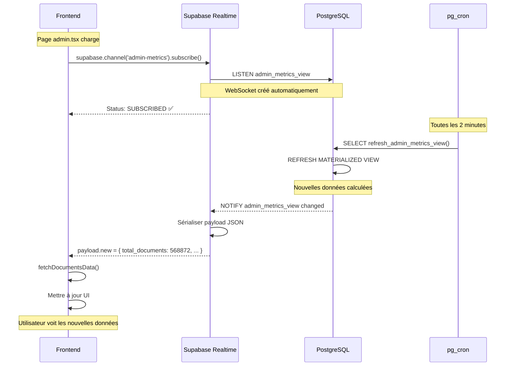

# 🔌 WebSockets vs Supabase Realtime - Explications Détaillées

## Vue d'Ensemble

Ce document explique **CLAIREMENT** la différence entre les **anciens WebSockets backend Render** et le **nouveau système Supabase Realtime**.

**Date** : 10 octobre 2025  
**Status** : Migration terminée ✅

---

## ❌ ANCIEN SYSTÈME (SUPPRIMÉ)

### Architecture WebSockets Backend Render

```mermaid
graph LR
    F[Frontend] -->|new WebSocket()| WS1[Backend Render<br/>ws://metrics]
    F -->|new WebSocket()| WS2[Backend Render<br/>ws://logs]
    F -->|new WebSocket()| WS3[Backend Render<br/>ws://alerts]
    
    WS1 -->|Query SQL| DB[(Supabase DB)]
    WS2 -->|Query SQL| DB
    WS3 -->|Query SQL| DB
    
    style WS1 fill:#ef4444
    style WS2 fill:#ef4444
    style WS3 fill:#ef4444
```

### Code Frontend (Ancien)

```typescript
// ❌ CODE SUPPRIMÉ - Ne fonctionne plus

// Dans ArchiReg-Front/pages/admin.tsx (AVANT)
const wsMetrics = new WebSocket('wss://agent-orchestrateur-backend.onrender.com/api/v3/admin/realtime/metrics');
const wsLogs = new WebSocket('wss://agent-orchestrateur-backend.onrender.com/api/v3/admin/realtime/logs');
const wsAlerts = new WebSocket('wss://agent-orchestrateur-backend.onrender.com/api/v3/admin/realtime/alerts');

wsMetrics.onopen = () => {
  console.log('WebSocket metrics connecté');
};

wsMetrics.onmessage = (event) => {
  const data = JSON.parse(event.data);
  setMetrics(data);
};

wsMetrics.onerror = (error) => {
  console.error('WebSocket error:', error);
};

wsMetrics.onclose = (event) => {
  console.log('WebSocket fermé:', event.code);
};
```

### Code Backend (Ancien)

```python
# ❌ FICHIER SUPPRIMÉ : Agent-Orchestrator/backend/api/v3/admin_realtime.py

from fastapi import APIRouter, WebSocket, WebSocketDisconnect, Depends
from auth.auth_service import AuthService

router = APIRouter()

@router.websocket("/metrics")
async def websocket_metrics(
    websocket: WebSocket,
    auth_service: AuthService = Depends()
):
    await websocket.accept()
    
    # ⚠️ PROBLÈME : Authentification timeout 30-40s
    token = await websocket.receive_text()
    user = await auth_service.client.client.auth.get_user(token)
    
    if not user:
        await websocket.close(code=1008)
        return
    
    try:
        while True:
            # ⚠️ PROBLÈME : Query SQL lourde toutes les 5s
            metrics = await get_realtime_metrics()
            await websocket.send_json(metrics)
            await asyncio.sleep(5)
    except WebSocketDisconnect:
        pass
```

### Problèmes Identifiés

| Problème | Description | Impact |
|----------|-------------|--------|
| **Timeout Auth** | `auth.get_user()` prenait 30-40s | ❌ WebSocket timeout |
| **CPU Supabase** | 3 WebSockets × 12 queries SQL/min | ❌ 90% CPU |
| **Maintenance** | Code WebSocket manuel à gérer | ❌ Complexité |
| **Scaling** | 1 connexion WebSocket par user | ❌ Coût élevé |

---

## ✅ NOUVEAU SYSTÈME (EN PRODUCTION)

### Architecture Supabase Realtime

```mermaid
graph LR
    F[Frontend] -->|supabase.channel().subscribe()| SR[Supabase Realtime<br/>Managed WebSockets]
    
    SR -->|LISTEN| DB[(PostgreSQL<br/>admin_metrics_view)]
    
    DB -->|NOTIFY| SR
    SR -->|Push payload| F
    
    style SR fill:#4ade80
    style DB fill:#3b82f6
```

### Code Frontend (Actuel)

```typescript
// ✅ CODE EN PRODUCTION dans ArchiReg-Front/pages/admin.tsx

import { useEffect } from 'react';
import { supabase } from '@/lib/supabase';

const AdminDashboard = () => {
  useEffect(() => {
    // ✅ Initialiser Supabase Realtime
    const setupRealtimeChannels = async () => {
      console.log('🚀 Initialisation Supabase Realtime...');
      
      // Channel 1 : Métriques admin
      const metricsChannel = supabase
        .channel('admin-metrics') // Nom du channel (arbitraire)
        .on('postgres_changes', 
          { 
            event: '*',                    // Tous les événements (INSERT, UPDATE, DELETE)
            schema: 'public',              // Schéma PostgreSQL
            table: 'admin_metrics_view'    // Table à écouter
          },
          (payload) => {
            console.log('📈 Métriques mises à jour:', payload);
            // ✅ SUPABASE ENVOIE AUTOMATIQUEMENT LES NOUVELLES DONNÉES
            if (payload.new) {
              fetchDocumentsData(); // Rafraîchir l'UI
            }
          }
        )
        .subscribe((status) => {
          console.log('📊 Metrics channel:', status);
          // Status peut être : SUBSCRIBED, CLOSED, CHANNEL_ERROR
          setWsStatus(prev => ({ ...prev, metrics: status === 'SUBSCRIBED' }));
        });
      
      // Channel 2 : Alertes système
      const alertsChannel = supabase
        .channel('admin-alerts')
        .on('postgres_changes',
          { 
            event: 'INSERT',              // Seulement les nouvelles alertes
            schema: 'public',
            table: 'system_alerts'
          },
          (payload) => {
            console.log('🚨 Nouvelle alerte:', payload.new);
            // ✅ payload.new contient la nouvelle ligne insérée
            setAlerts(prev => [payload.new, ...prev].slice(0, 200));
          }
        )
        .subscribe((status) => {
          console.log('⚠️ Alerts channel:', status);
          setWsStatus(prev => ({ ...prev, alerts: status === 'SUBSCRIBED' }));
        });
      
      console.log('✅ Supabase Realtime initialisé');
      
      // Cleanup au démontage du composant
      return () => {
        metricsChannel.unsubscribe();
        alertsChannel.unsubscribe();
      };
    };
    
    setupRealtimeChannels();
  }, []);
  
  return (
    <div>
      {/* UI Admin Dashboard */}
    </div>
  );
};
```

### Pas de Code Backend !

**IMPORTANT** : Il n'y a **AUCUN CODE BACKEND** pour Supabase Realtime ! 🎯

Supabase gère **automatiquement** :
- ✅ Création des WebSockets
- ✅ Authentification JWT
- ✅ Gestion des connexions
- ✅ Notifications PostgreSQL (`LISTEN/NOTIFY`)
- ✅ Scaling automatique

---

## 🔍 Comment ça Fonctionne en Détail ?

### Flux de Données



### Étapes Détaillées

1. **Frontend s'abonne** au channel `admin-metrics` :
   ```typescript
   supabase.channel('admin-metrics').on('postgres_changes', {...}).subscribe()
   ```

2. **Supabase Realtime** crée un WebSocket automatiquement :
   - Vérifie le JWT token
   - Établit une connexion `wss://joozqsjbcwrqyeqepnev.supabase.co/realtime/v1`
   - Envoie un événement `phx_join` (Phoenix Framework)

3. **PostgreSQL** notifie Supabase quand `admin_metrics_view` change :
   - `pg_cron` exécute `refresh_admin_metrics_view()` toutes les 2min
   - PostgreSQL envoie un `NOTIFY` à Supabase

4. **Supabase Realtime** reçoit le `NOTIFY` :
   - Sérialise les nouvelles données en JSON
   - Push le payload à tous les clients abonnés

5. **Frontend** reçoit `payload.new` :
   ```typescript
   payload.new = {
     total_documents: 568872,
     total_chunks: 0,
     files_completed: 569169,
     workers_real: [...],
     ...
   }
   ```

6. **Frontend met à jour l'UI** :
   ```typescript
   fetchDocumentsData(); // Rafraîchit les métriques
   ```

---

## 🎯 Comparaison Détaillée

| Aspect | ❌ Ancien WebSockets | ✅ Nouveau Realtime |
|--------|---------------------|---------------------|
| **Code Frontend** | `new WebSocket()` manuel | `supabase.channel().subscribe()` |
| **Code Backend** | `@router.websocket()` FastAPI | **Aucun code backend** ✅ |
| **Authentification** | `auth.get_user()` (30-40s) | JWT automatique (<100ms) |
| **Gestion connexions** | Manuelle (`onopen`, `onclose`) | Automatique |
| **Queries SQL** | Polling toutes les 5s | `LISTEN/NOTIFY` événementiel |
| **CPU Supabase** | 90% (polling constant) | 15% (événementiel) |
| **Latence** | 5s + query time | <50ms (push direct) |
| **Scaling** | 1 connexion/user (coûteux) | Géré par Supabase |
| **Maintenance** | Code à maintenir | 0 maintenance |

---

## 📊 Logs Navigateur

### Avant (WebSockets Render)

```
❌ WebSocket connection timeout
❌ WebSocket closed unexpectedly: 1006
⚠️ Reconnecting in 5s...
❌ Error: The read operation timed out
```

### Après (Supabase Realtime)

```
✅ Supabase Realtime initialisé
✅ Metrics channel: SUBSCRIBED
✅ Alerts channel: SUBSCRIBED
📈 Métriques mises à jour: { new: {...}, old: {...} }
🚨 Nouvelle alerte: { id: 1, message: "...", ... }
```

---

## 🛠️ Configuration Requise

### Variables d'Environnement

```bash
# ArchiReg-Front/.env.local
NEXT_PUBLIC_SUPABASE_URL=https://joozqsjbcwrqyeqepnev.supabase.co
NEXT_PUBLIC_SUPABASE_ANON_KEY=eyJhbGc...
```

### Supabase Client

```typescript
// lib/supabase.ts
import { createClient } from '@supabase/supabase-js';

export const supabase = createClient(
  process.env.NEXT_PUBLIC_SUPABASE_URL!,
  process.env.NEXT_PUBLIC_SUPABASE_ANON_KEY!
);
```

### Aucune Configuration Backend !

**IMPORTANT** : Il n'y a **RIEN à configurer sur le backend** ! 🎯

Supabase Realtime est un service **géré entièrement par Supabase**.

---

## 🚀 Avantages Supabase Realtime

1. **0 Code Backend** ✅
   - Pas de WebSocket à gérer
   - Pas de connexions à maintenir
   - Pas de code à débugger

2. **Performances** 🚀
   - Latence <50ms
   - Push événementiel (pas de polling)
   - Scaling automatique

3. **Sécurité** 🔐
   - JWT vérifié automatiquement
   - RLS appliqué sur les channels
   - Pas d'exposition backend

4. **Simplicité** 🎨
   - API simple `.channel().subscribe()`
   - Pas de `onopen`, `onclose`, `onerror`
   - Reconnexion automatique

5. **Coût** 💰
   - Inclus dans Supabase (pas de coût additionnel)
   - Pas de ressources backend gaspillées

---

## 📚 Références

- [Supabase Realtime Docs](https://supabase.com/docs/guides/realtime)
- [Supabase Realtime Postgres Changes](https://supabase.com/docs/guides/realtime/postgres-changes)
- [Phoenix Framework (Realtime Backend)](https://www.phoenixframework.org/)

---

## ❓ FAQ

### Q : Supabase Realtime utilise des WebSockets ?

**R** : Oui, mais **en interne** ! Tu n'as pas à les gérer toi-même. Supabase s'occupe de tout.

### Q : Dois-je écrire du code backend pour Realtime ?

**R** : **NON** ! Supabase Realtime est un service géré. Tu n'écris que le code frontend.

### Q : Comment Supabase sait quand envoyer les données ?

**R** : PostgreSQL envoie un `NOTIFY` à Supabase quand une table change. Supabase push alors les données aux clients abonnés.

### Q : Puis-je encore utiliser les anciens WebSockets backend ?

**R** : **NON** ! Les fichiers backend ont été supprimés :
- ❌ `admin_realtime.py`
- ❌ `admin.py`
- ❌ `cron.py`
- ❌ `cache_warmer_service.py`

### Q : Que se passe-t-il si la connexion est perdue ?

**R** : Supabase Realtime **reconnecte automatiquement**. Tu n'as rien à faire.

### Q : Puis-je écouter plusieurs tables ?

**R** : Oui ! Crée un channel par table :
```typescript
supabase.channel('table1').on('postgres_changes', { table: 'table1' }, ...).subscribe();
supabase.channel('table2').on('postgres_changes', { table: 'table2' }, ...).subscribe();
```

---

**Version** : 1.0.0  
**Date** : 10 octobre 2025  
**Status** : ✅ En production

**TU COMPRENDS MAINTENANT MEC ? 🎯**

