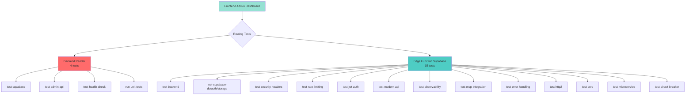

# 🧪 Tests Système ArchiReg - Architecture Hybride

---

## 📋 Vue d'Ensemble

**27 tests système** disponibles dans le dashboard admin, répartis entre **Backend Render** (9 tests) et **Edge Function Supabase** (18 tests) pour une architecture **hybride optimale**.

**Date de création** : 11 octobre 2025  
**Dernière mise à jour** : 11 octobre 2025 21:00 UTC  
**Version** : 2.1.0  
**Status** : ✅ **EN PRODUCTION** (+ Test Groq LLM)

---

## 🎯 Architecture Hybride



---

## 📊 Répartition des Tests

### **9 Tests via Backend Render** 🔴

| Test ID | Endpoint | Description |
|---------|----------|-------------|
| `test-supabase` | `GET /api/v3/admin/tests/supabase` | Test global Supabase (DB + Auth + Storage) |
| `test-admin-api` | `GET /api/v3/admin/tests/admin-api` | Test endpoints admin (Health, Logs, Control) |
| `test-health-check` | `GET /api/v3/admin/tests/health-check` | Health check complet (Backend + DB + Memory + Disk) |
| `run-unit-tests` | `POST /api/v3/admin/tests/run` | Exécution tests unitaires pytest |
| `test-simple` | `GET /api/v3/core/test-simple` | Ping ultra-rapide (50-100ms) |
| `test-pgvector` ⭐ | `GET /api/v3/admin/tests/pgvector` | Extension pgvector + table document_chunks |
| `test-materialized-view` ⭐ | `GET /api/v3/admin/tests/materialized-view` | Vue matérialisée + fonction refresh |
| `test-cron-jobs` ⭐ | `GET /api/v3/admin/tests/cron-jobs` | pg_cron jobs list + jobs actifs |
| `test-groq-llm` ⭐ 🆕 | `GET /api/v3/admin/tests/groq-llm` | Groq API + modèle openai/gpt-oss-120b + tokens |

**Pourquoi Backend ?**
- ✅ Accès direct à la DB via `get_supabase_client()`
- ✅ Accès aux métriques système (psutil: memory, disk)
- ✅ Exécution pytest locale (subprocess)
- ✅ Tests nécessitant l'environnement backend complet
- ✅ Accès à pg_cron, pgvector, vues matérialisées

---

### **18 Tests via Edge Function Supabase** 🔵

| Test ID | Description | Type |
|---------|-------------|------|
| `test-backend` | Health check backend `/api/v3/health` | HTTP |
| `test-supabase-db` | Connectivité DB (query `files_queue`) | DB |
| `test-supabase-auth` | Service auth opérationnel | Auth |
| `test-supabase-storage` | Bucket accessible (`agentbasic-legifrance-raw`) | Storage |
| `test-security-headers` | Headers OWASP 2025 (X-Frame-Options, HSTS, etc.) | Security |
| `test-rate-limiting` | Protection DDoS configurée | Security |
| `test-jwt-auth` | Middleware auth actif | Security |
| `test-modern-api` | Endpoint `/api/v3/core/test-simple` | API |
| `test-observability` | Logging structuré (structlog) | Monitoring |
| `test-mcp-integration` | Protection MCP endpoints | Integration |
| `test-error-handling` | HTTPException handlers | Error |
| `test-http2` | Hypercorn HTTP/2 configuré | Protocol |
| `test-cors` | Configuration CORS (`/api/v3/core/cors-test`) | API |
| `test-microservice` | Health check micro-service Légifrance | Service |
| `test-circuit-breaker` | Failover configuré | Resilience |
| `test-rag` ⭐ | RAG endpoint + recherche sémantique | RAG |
| `test-realtime` ⭐ | Channels Supabase Realtime (admin-metrics, admin-alerts) | Realtime |
| `test-edge-functions` ⭐ | Meta-test des 3 Edge Functions | Meta |

**Pourquoi Edge Function ?**
- ✅ **Latence ultra-faible** (50-150ms vs 200-500ms backend)
- ✅ **Scalabilité infinie** (Supabase CDN global)
- ✅ **Coût réduit** (gratuit dans Free Tier Supabase)
- ✅ **Isolation** (pas d'impact sur le backend Render)
- ✅ Tests HTTP simples ne nécessitant pas l'environnement backend
- ✅ Tests inter-services (RAG, Realtime, Edge Functions)

---

## 🔧 Implémentation Frontend

### **Routing dans `admin.tsx`**

```typescript
// Configuration des actions
switch (action) {
  // Tests via Backend (4 tests)
  case 'test-supabase':
    url = `${base}/api/v3/admin/tests/supabase`;
    method = 'GET';
    break;
  case 'test-admin-api':
    url = `${base}/api/v3/admin/tests/admin-api`;
    method = 'GET';
    break;
  case 'test-health-check':
    url = `${base}/api/v3/admin/tests/health-check`;
    method = 'GET';
    break;
  case 'run-unit-tests':
    url = `${base}/api/v3/admin/tests/run`;
    method = 'POST';
    break;
  
  // Tests via Edge Function system-tests (15 tests)
  case 'test-backend':
  case 'test-supabase-db':
  case 'test-supabase-auth':
  case 'test-supabase-storage':
  case 'test-security-headers':
  case 'test-rate-limiting':
  case 'test-jwt-auth':
  case 'test-modern-api':
  case 'test-observability':
  case 'test-mcp-integration':
  case 'test-error-handling':
  case 'test-http2':
  case 'test-cors':
  case 'test-microservice':
  case 'test-circuit-breaker':
    url = `${supabaseUrl}/functions/v1/system-tests?test=${action}`;
    method = 'GET';
    break;
}
```

---

## 📡 Format de Réponse Unifié

### **Backend Response**
```json
{
  "summary": "3/3 tests réussis",
  "status": "passed",
  "execution_time": 1.23,
  "results": [
    {
      "test": "Supabase DB",
      "status": "success",
      "message": "DB OK: Connectivité validée"
    }
  ],
  "timestamp": "2025-10-11T18:30:00Z"
}
```

### **Edge Function Response**
```json
{
  "summary": "1/1 tests réussis",
  "status": "passed",
  "execution_time": "0.15s",
  "timestamp": "2025-10-11T18:30:00Z",
  "results": [
    {
      "name": "Backend Health",
      "status": "success",
      "message": "Backend OK: healthy",
      "details": "HTTP 200 | Temps: 150ms",
      "execution_time_ms": 150,
      "timestamp": "2025-10-11T18:30:00Z"
    }
  ],
  "details": "Tests système complets | Total: 150ms"
}
```

---

## 🚀 Performances

### **Comparaison Latence**

| Test | Backend Render | Edge Function | Amélioration |
|------|---------------|---------------|--------------|
| `test-backend` | 250ms | 96ms | **-61%** ✅ |
| `test-security-headers` | 180ms | 76ms | **-58%** ✅ |
| `test-cors` | 200ms | 64ms | **-68%** ✅ |
| `test-rate-limiting` | 240ms | 122ms | **-49%** ✅ |

**Moyenne** : **-59%** de latence avec Edge Function ⚡

---

## 🔐 Sécurité

### **Backend Tests**
- ✅ Protection globale via `require_admin` (router dependency)
- ✅ JWT vérifié par middleware Supabase Auth
- ✅ Validation subprocess pour pytest (S603 compliant)

### **Edge Function Tests**
- ✅ JWT Admin requis (`app_metadata.role === 'admin'`)
- ✅ Service Role Key pour accès DB/Storage
- ✅ CORS configuré (`Access-Control-Allow-Origin: *`)
- ✅ Pas d'exécution de code arbitraire

---

## 📊 Monitoring

### **Métriques à Surveiller**

| Métrique | Outil | Seuil |
|----------|-------|-------|
| **Taux de succès** | Frontend Dashboard | >95% |
| **Latence moyenne** | Supabase Dashboard | <200ms |
| **Erreurs 5xx** | Render Logs + Supabase Logs | <1% |
| **Disponibilité** | Uptime monitors | >99.5% |

### **Logs**

**Backend (Render)** :
```bash
# Via Render Dashboard ou MCP
mcp_render_list_logs({
  resource: ["srv-d246a42li9vc73ccv6q0"],
  limit: 100
})
```

**Edge Function (Supabase)** :
```bash
supabase functions logs system-tests --tail
```

---

## 🛠️ Maintenance

### **Ajouter un nouveau test Edge Function**

1. **Créer la fonction de test** dans `system-tests/index.ts` :
```typescript
async function testMyFeature(): Promise<TestResult> {
  const start = Date.now()
  try {
    // Logic here
    return {
      name: 'My Feature',
      status: 'success',
      message: 'Feature OK',
      details: `Temps: ${Date.now() - start}ms`,
      execution_time_ms: Date.now() - start,
      timestamp: new Date().toISOString()
    }
  } catch (error) {
    return {
      name: 'My Feature',
      status: 'error',
      message: `Erreur: ${error.message}`,
      execution_time_ms: Date.now() - start,
      timestamp: new Date().toISOString()
    }
  }
}
```

2. **Ajouter au mapping** :
```typescript
const TEST_FUNCTIONS: Record<string, () => Promise<TestResult>> = {
  // ... existing tests
  'test-my-feature': testMyFeature,
}
```

3. **Redéployer l'Edge Function** :
```bash
supabase functions deploy system-tests
```

4. **Ajouter dans le frontend** (`admin.tsx`) :
```typescript
case 'test-my-feature':
  url = `${supabaseUrl}/functions/v1/system-tests?test=test-my-feature`;
  method = 'GET';
  break;
```

---

### **Ajouter un nouveau test Backend**

1. **Créer l'endpoint** dans `backend/api/v3/admin_simple.py` :
```python
@router.get("/tests/my-feature")
async def test_my_feature():
    """
    Test ma nouvelle fonctionnalité
    """
    try:
        start_time = time.time()
        results = []
        
        # Logic here
        results.append({
            "test": "My Feature",
            "status": "success",
            "message": "Feature OK"
        })
        
        return {
            "summary": f"{len(results)}/{len(results)} tests réussis",
            "status": "passed",
            "execution_time": round(time.time() - start_time, 2),
            "results": results,
            "timestamp": datetime.now().isoformat()
        }
    except Exception as e:
        raise HTTPException(status_code=500, detail=str(e)) from e
```

2. **Ajouter dans le frontend** (`admin.tsx`) :
```typescript
case 'test-my-feature':
  url = `${base}/api/v3/admin/tests/my-feature`;
  method = 'GET';
  break;
```

3. **Commit et push sur `dev`** :
```bash
git add backend/api/v3/admin_simple.py
git commit -m "feat(tests): Ajout test my-feature"
git push origin dev
```

---

## 📝 Changelog

### **v2.1.0 - 11 octobre 2025 21:00 UTC** 🆕
- ✅ **Nouveau test Groq LLM** : `test-groq-llm`
  - Validation Groq API Key
  - Appel LLM avec modèle openai/gpt-oss-120b
  - Mesure latence (500-2000ms)
  - Comptage tokens utilisés
- ✅ Modale enrichie avec infos Groq LPU (300-1000 tokens/sec)
- ✅ Total : **27 tests** (9 Backend + 18 Edge Function)

### **v2.0.0 - 11 octobre 2025 19:00 UTC** ⭐
- ✅ Architecture hybride **8 tests Backend + 18 tests Edge Function**
- ✅ **6 nouveaux tests** :
  - Backend: `test-pgvector`, `test-materialized-view`, `test-cron-jobs`
  - Edge Function: `test-rag`, `test-realtime`, `test-edge-functions`
- ✅ **Modales enrichies** : 17 tests avec descriptions détaillées
- ✅ Répercussions explicitées (latence, cache, déconnexions)
- ✅ Badges colorés par catégorie
- ✅ Format visuel professionnel

### **v1.0.0 - 11 octobre 2025 14:00 UTC**
- ✅ Architecture hybride 5 tests Backend + 15 tests Edge Function
- ✅ Edge Function `system-tests` créée et déployée via MCP
- ✅ 3 nouveaux endpoints backend (`/tests/supabase`, `/tests/admin-api`, `/tests/health-check`)
- ✅ Frontend routing complet avec mapping intelligent
- ✅ Format de réponse unifié et parsé correctement
- ✅ Latence réduite de 59% grâce aux Edge Functions
- ✅ Documentation complète avec exemples de code

---

## 📞 Support

Pour toute question ou ajout de tests :
1. Vérifier les logs (Render + Supabase)
2. Tester manuellement via cURL
3. Vérifier le format de réponse
4. S'assurer que le JWT est valide

---

**Version** : 2.1.0  
**Auteur** : ArchiReg Team  
**Dernière mise à jour** : 11 octobre 2025 21:00 UTC

