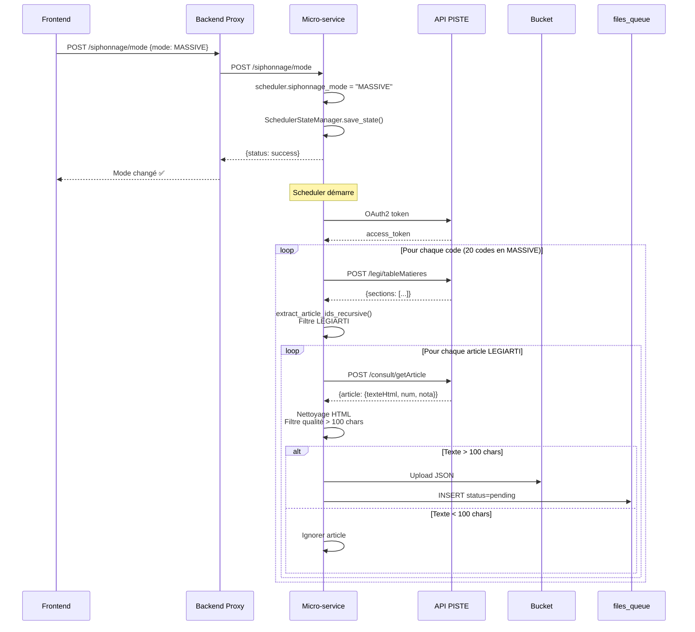

# 🏗️ ARCHITECTURE MICRO-SERVICE LÉGIFRANCE

**Date** : 15 octobre 2025  
**Version** : 3.0 UNIFICATION + FIX LEGIARTI  
**Framework** : FastAPI + Python 3.11.11

---

## 🎯 Responsabilités

### **CE QU'IL FAIT** ✅

```
API PISTE Légifrance
    ↓ OAuth2 + Rate Limiting
Collecte intelligente
    ↓ Filtre LEGIARTI + Qualité
Upload DIRECT Bucket Supabase
    ↓ INSERT automatique
files_queue (Workers)
```

1. **Authentification OAuth2** avec API PISTE
2. **Collecte hiérarchique** via `/consult/legi/tableMatieres`
3. **Filtre LEGIARTI** : Garde seulement vrais articles (ignore LEGISCTA)
4. **Filtre qualité** : Texte > 100 chars après nettoyage HTML
5. **Upload direct** : Bucket Supabase (sans passer par backend)
6. **INSERT auto** : files_queue pour Workers
7. **Rate limiting** : Respect quotas PISTE (60 req/s, 1.28M/jour)

### **CE QU'IL NE FAIT PAS** ❌

- ❌ Parsing/extraction texte (Workers)
- ❌ Génération embeddings (Workers)
- ❌ Stockage pgvector (Workers)
- ❌ Recherche sémantique (Backend)
- ❌ Chat avec LLM (Backend)

---

## 📊 SERVICES PRINCIPAUX

### **1. LegiffranceService** (`app/services/legifrance_service.py`)

**Rôle** : Communication avec API PISTE

```python
class LegiffranceService:
    # OAuth2
    async def _authenticate() -> bool
    
    # Requêtes API
    async def _make_request(endpoint, payload) -> Dict
    
    # Méthodes principales
    async def get_table_matieres(text_id) -> Dict
    async def consult_article(article_id) -> Dict
    def extract_article_ids_recursive(articles) -> List[str]  # ✅ Filtre LEGIARTI
```

**Endpoints utilisés** :
- `POST /consult/legi/tableMatieres` : Hiérarchie codes
- `POST /consult/getArticle` : Texte complet articles

---

### **2. SupabaseService** (`app/services/supabase_service.py`)

**Rôle** : Upload bucket + INSERT files_queue

```python
class SupabaseService:
    # Upload direct
    async def save_legal_document(document, category) -> bool
    
    # Auto-sync
    async def check_queue_coherence() -> dict
    async def auto_sync_storage_to_queue() -> dict
```

**Actions** :
1. Upload JSON vers bucket `agentbasic-legifrance-raw`
2. INSERT dans `files_queue` (status: pending)
3. Vérification cohérence au démarrage
4. Auto-sync si écart 5-100k fichiers

---

### **3. CollectorScheduler** (`app/scheduler/collector_scheduler.py`)

**Rôle** : Orchestration collecte MASSIVE/MAINTENANCE

```python
class CollectorScheduler:
    # Modes
    siphonnage_mode: str  # MASSIVE ou MAINTENANCE
    
    # Contrôle
    async def start()
    async def stop()
    
    # Job principal (UNIFIÉ pour les 2 modes)
    async def _run_collection_job(target_codes)
```

**Différence modes** :
- MASSIVE : 20 codes, interval 10 min
- MAINTENANCE : 5 codes, CRON 2h

**Stratégie** : IDENTIQUE (filtre LEGIARTI + qualité 100 chars)

---

### **4. SchedulerStateManager** (`app/scheduler/scheduler_state.py`)

**Rôle** : Persistance état scheduler

```python
class SchedulerStateManager:
    @staticmethod
    def save_state(running: bool, mode: str)
    
    @staticmethod
    def load_state() -> Dict
```

**Fichier** : `/tmp/scheduler_state.json`

**Format** :
```json
{
  "running": true,
  "mode": "MAINTENANCE"
}
```

**Workflow** :
1. Démarrage → Charge état
2. START/STOP/MODE → Sauvegarde état
3. Crash → Redémarre si était running

---

### **5. DifferentiatedRateLimiter** (`app/utils/rate_limiter.py`)

**Rôle** : Rate limiting avec quotas différenciés

```python
class DifferentiatedRateLimiter:
    # Limiters
    cnil_limiter: SlidingWindowRateLimiter      # 40 req/s
    standard_limiter: SlidingWindowRateLimiter  # 20 req/s
    
    # Quotas
    cnil_quota_monitor: QuotaMonitor     # 1M req/jour
    standard_quota_monitor: QuotaMonitor # 280k req/jour
    
    # Routing intelligent
    async def acquire(endpoint: str) -> bool
```

**Endpoints CNIL** (40 req/s) :
- `/consult/getCnilWithAncienId`
- `/consult/cnil`

**Autres endpoints** (20 req/s) :
- Tous les autres

---

## 🔄 FLUX DE DONNÉES COMPLET



---

## 📁 STRUCTURE FICHIERS

```
Micro-service-data-legifrance-piste/
├── app/
│   ├── main.py                     # Application FastAPI
│   ├── core/
│   │   ├── config.py              # Configuration env
│   │   └── logging.py             # Structlog
│   ├── services/
│   │   ├── legifrance_service.py  # API PISTE
│   │   ├── supabase_service.py    # Upload bucket
│   │   └── mass_collector_service.py  # Collecte optimisée (legacy)
│   ├── scheduler/
│   │   ├── collector_scheduler.py # Orchestration
│   │   └── scheduler_state.py     # Persistance état
│   └── utils/
│       └── rate_limiter.py        # Rate limiting différencié
├── requirements.txt                # Dépendances Python
├── Dockerfile                      # Multi-stage build
└── render.yaml                     # Config Render
```

---

## 🔐 VARIABLES D'ENVIRONNEMENT

### **Légifrance PISTE**
```bash
LEGIFRANCE_CLIENT_ID=xxx
LEGIFRANCE_CLIENT_SECRET=xxx
LEGIFRANCE_OAUTH_URL=https://sandbox-oauth.piste.gouv.fr/api/oauth/token
LEGIFRANCE_API_BASE_URL=https://sandbox-api.piste.gouv.fr/dila/legifrance/lf-engine-app
```

### **Supabase**
```bash
SUPABASE_URL=https://joozqsjbcwrqyeqepnev.supabase.co
SUPABASE_SERVICE_ROLE_KEY=xxx
DATABASE_URL=postgresql://postgres...
```

### **Configuration**
```bash
ENVIRONMENT=production
ENABLE_SCHEDULER=true
SIPHONNAGE_MODE=MAINTENANCE  # ou MASSIVE
COLLECTION_PHASE=DISCOVERY_CODES_EXTENDED
```

### **Rate Limiting**
```bash
LEGIFRANCE_MAX_REQUESTS_PER_SECOND=60      # 40+20
LEGIFRANCE_MAX_REQUESTS_PER_HOUR=24000
MAX_DAILY_REQUESTS=1280000                  # 1M+280k
```

---

## 📡 API ENDPOINTS

### **Contrôle Scheduler** (via Backend Proxy)
```
POST /aspirage/start         # Démarre collecte
POST /aspirage/stop          # Arrête collecte
GET  /aspirage/status        # État scheduler
POST /siphonnage/mode        # Change MASSIVE ↔ MAINTENANCE
```

### **Monitoring**
```
GET /health                  # Health check
GET /stats                   # Stats complètes
GET /rate-limit/stats        # Stats rate limiting
```

### **Tests**
```
POST /collect/manual         # Test collecte
GET  /api/test/simple        # Test config
```

---

## 🎯 Flux Startup

```
1. main.py - lifespan()
    ↓
2. Initialisation services
   - SupabaseService.initialize()
   - LegiffranceService.initialize()
   - MassCollectorService créé
    ↓
3. Création scheduler
   - CollectorScheduler(legifrance, supabase)
    ↓
4. Chargement état sauvegardé
   - SchedulerStateManager.load_state()
   - Restauration mode (MASSIVE ou MAINTENANCE)
    ↓
5. Auto-sync intelligent
   - check_queue_coherence()
   - auto_sync si 5-100k manquants
    ↓
6. Redémarrage si était running
   - scheduler.start() si état = running
    ↓
7. ✅ Service prêt
   - Keep-alive ping 10 min
   - Collecte selon mode
```

---

## 🔧 DOCKER MULTI-STAGE

### **Stage 1 : Builder**
```dockerfile
FROM python:3.11.11-slim as builder
RUN pip install -r requirements.txt
```

### **Stage 2 : Runtime**
```dockerfile
FROM python:3.11.11-slim as runtime
COPY --from=builder /venv /venv
USER appuser (non-root)
CMD gunicorn app.main:app -w 1 -k uvicorn.workers.UvicornWorker
```

**Avantages** :
- ✅ Image optimisée (~500 MB)
- ✅ Non-root user (sécurité)
- ✅ Health check configuré
- ✅ Auto-restart Render

---

## 🎉 Résumé Architecture

**Micro-service autonome** :
- ✅ 5 services principaux
- ✅ 3 modes (MASSIVE, MAINTENANCE, MANUAL)
- ✅ 2 filtres qualité (LEGIARTI + 100 chars)
- ✅ Upload direct Supabase
- ✅ Auto-sync intelligent
- ✅ Persistance état
- ✅ Rate limiting différencié

**Architecture propre, optimisée, résiliente !** 🚀

