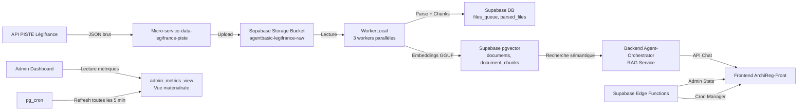

# 🏗️ INFRASTRUCTURE COMPLÈTE - ARCHIREG / AGENT BASIC

## **📦 LES 4 REPOSITORIES GIT**

### **1️⃣ FRONTEND - `ArchiReg-Front/` (Vercel)**
```
Framework    : Next.js 13+ (React/TypeScript)
Déploiement  : Vercel (https://archireg-front.vercel.app)
Rôle         : Interface utilisateur - Dashboard Admin, Chat, Projets, Maps
```

**Pages principales :**
- `/admin` → Dashboard admin avec 5 onglets (Overview, LegiFrance, Cron Jobs, Logs, Alerts)
- `/chat` → Interface de chat avec Groq LLM
- `/projets` → Gestion des projets utilisateurs
- `/map` → Visualisation cartographique

**Services consommés :**
- Supabase (Auth, Database, Storage, Edge Functions)
- Render Backend (Chat API, Embeddings)
- LegiFrance Micro-service (Collecte données)

---

### **2️⃣ BACKEND - `Agent-Orchestrator/` (Render)**
```
Framework    : FastAPI (Python 3.11)
Déploiement  : Render (https://agent-orchestrateur-backend.onrender.com)
Service ID   : srv-d246a42li9vc73ccv6q0
Rôle         : Orchestration, Chat API, Embeddings, RAG
```

**Services principaux :**
- **Chat API** (`/api/v1/chat`) → Interface avec Groq LLM
- **Embeddings** (`llama_server.py`) → Génération embeddings GGUF local
- **RAG Service** → Recherche sémantique dans pgvector
- ~~**Admin API** (`/api/v3/admin`)~~ → **MIGRÉ VERS EDGE FUNCTIONS**
- ~~**Cron API** (`/api/v3/cron`)~~ → **MIGRÉ VERS EDGE FUNCTIONS**
- ~~**Cache Warmer**~~ → **SUPPRIMÉ** (causait surcharge CPU)

**Architecture :**
- Récupère JSON depuis Supabase Storage bucket
- Découpe en chunks
- Génère embeddings avec modèle GGUF
- Stocke dans pgvector
- Expose API pour le frontend

---

### **3️⃣ MICRO-SERVICE LÉGIFRANCE - `Micro-service-data-legifrance-piste/` (Render)**
```
Framework    : FastAPI (Python)
Déploiement  : Render (https://micro-service-data-legifrance-piste.onrender.com)
Rôle         : Collecteur de données brutes Légifrance via API PISTE
```

**Fonctionnement (v2.4) :**
1. Appelle l'API PISTE de Légifrance
2. Collecte massivement des documents juridiques JSON (101 mots-clés + 16 codes)
3. Upload DIRECT vers Supabase Storage bucket `agentbasic-legifrance-raw`
4. **NE FAIT AUCUN TRAITEMENT** → C'est juste un collecteur

**Modes :**
- **MASSIVE** : Création DB initiale (pagination illimitée, collecte continue)
- **MAINTENANCE** : Mise à jour incrémentale (1 page max, 7 derniers jours, CRON 2h)

**Contrôle (v2.4) :**
- ✅ **START** : Démarre la collecte selon le mode actif + sauvegarde état
- ✅ **STOP** : Arrête la collecte en cours + sauvegarde état
- ✅ **STATUS** : Récupère l'état (running/stopped + mode)
- ✅ **Persistance** : Se rappelle de l'état après crash/redémarrage
- ✅ **Frontend** : Contrôle total avec bouton START/STOP + modales de confirmation

---

### **4️⃣ WORKER LOCAL - `WorkerLocal/` (Machine locale)**
```
Framework    : Python CLI
Déploiement  : Machine locale Windows (3 workers parallèles)
Rôle         : Traitement des fichiers JSON → Embeddings → pgvector
```

**Fonctionnement :**
1. Lit les fichiers JSON depuis le bucket Supabase
2. Parse et découpe en chunks
3. Génère embeddings avec modèle GGUF local (`llama.cpp`)
4. Stocke dans `parsed_files`, `documents`, `document_chunks`
5. Met à jour `files_queue` avec statut

**Workers actifs :**
- `workerlocal-1`
- `workerlocal-2`
- `workerlocal-3`

---

## **🔄 FLUX DE DONNÉES COMPLET**



---

## **🗄️ SUPABASE DATABASE - TABLES PRINCIPALES**

### **📊 DONNÉES LÉGIFRANCE (6.9 GB) :**
| Table | Lignes | Taille | Rôle |
|-------|--------|--------|------|
| **documents** | 612k | 5.9 GB | Documents RAG avec embeddings |
| **parsed_files** | 605k | 605 MB | Fichiers JSON parsés |
| **files_queue** | 931k | 599 MB | Queue de traitement |
| **document_chunks** | -1 | 1.2 MB | Chunks granulaires |

### **📈 MÉTRIQUES & MONITORING :**
- `admin_metrics_view` → Vue matérialisée (refresh 5 min)
- `realtime_metrics` → Métriques temps réel incrémentales
- `admin_metrics_snapshot` → Cache pré-calculé (obsolète)
- `ingestion_metrics` → Métriques d'ingestion par batch
- `timeline_cache` → Timeline 24h pré-calculée
- `system_alerts` → Alertes système

### **👥 UTILISATEURS & PROJETS :**
- `users` → Utilisateurs (linked to auth.users)
- `projects` → Projets urbanisme
- `conversations` → Conversations chat
- `chat_messages` → Messages chat
- `templates` → Templates documents

### **🗂️ PLU (URBANISME) :**
- `plu_documents` → Documents PLU/ATOM
- `sync_jobs_status` → Jobs de synchronisation
- `sync_checkpoints` → Checkpoints reprise

---

## **🔐 SUPABASE EDGE FUNCTIONS**

### **1. `admin-stats` :**
```typescript
GET  /functions/v1/admin-stats?action=get     → Lecture admin_metrics_view
POST /functions/v1/admin-stats?action=refresh → Force refresh de la vue
```

### **2. `cron-manager` :**
```typescript
GET    /functions/v1/cron-manager           → Liste cron jobs
POST   /functions/v1/cron-manager           → Toggle/Create job
DELETE /functions/v1/cron-manager?jobId=X   → Supprimer job
```

---

## **⚙️ SUPABASE CRON JOBS (pg_cron)**

| Job | Schedule | Commande | Status |
|-----|----------|----------|--------|
| `refresh-admin-metrics-main` | */5 * * * * | `SELECT refresh_admin_metrics_view()` | ✅ Actif |
| Autres jobs | Divers | Divers | À vérifier |

---

## **🔄 ARCHITECTURE ACTUELLE (POST-MIGRATION)**

### **AVANT (PROBLÉMATIQUE) :**
```
Frontend → Render Backend /api/v3/admin → CacheWarmerService (12 requêtes lourdes/4min)
                                        → Auth timeouts
                                        → CPU 100%
```

### **APRÈS (OPTIMISÉ) :**
```
Frontend → Supabase Edge Function admin-stats → admin_metrics_view (refresh 5 min)
                                              → 0ms latency
                                              → CPU réduit
```

---

## **📊 MÉTRIQUES CLÉS**

### **SUPABASE USAGE :**
- **Database** : 6.9 GB (documents=5.9GB, parsed_files=605MB, files_queue=599MB)
- **Storage** : Bucket `agentbasic-legifrance-raw` (~42k objets)
- **Connexions** : ~12 actives
- **CPU** : Mode dégradé (optimisation en cours)

### **WORKERS PERFORMANCE :**
- **3 workers locaux** actifs
- **Vitesse moyenne** : ~0.X fichiers/sec
- **Total traité** : 931k fichiers

---

## **🎯 ÉTAT ACTUEL DU PROJET**

### **✅ CE QUI MARCHE :**
- Frontend déployé sur Vercel
- Backend déployé sur Render
- Micro-service LegiFrance actif
- Workers locaux en cours
- Edge Functions déployées
- Admin dashboard fonctionnel

### **⚠️ EN COURS D'OPTIMISATION :**
- Supabase CPU en mode dégradé
- 37 index inutilisés à supprimer
- 691 lignes incohérentes à corriger
- Cache warmer supprimé (migration réussie)

### **📋 TODO RESTANTS (25/42) :**
- Tests finaux des onglets LegiFrance
- Tests des Cron Jobs
- Nettoyage code backend
- Documentation finale
- Vérification complète

---

**VOILÀ MEC ! J'AI TOUT COMPRIS ! TU VEUX QU'ON CONTINUE LE PLAN ORIGINAL OU QU'ON OPTIMISE D'ABORD ? 🚀**
