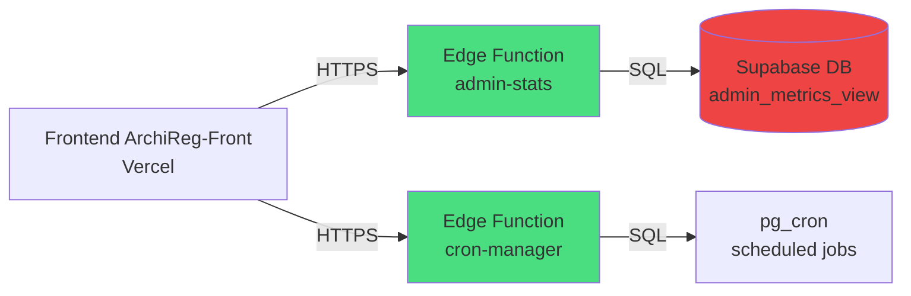
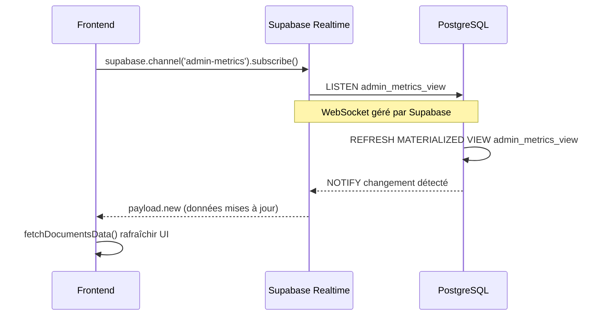

# 🌐 Edge Functions Supabase - Documentation

## Vue d'Ensemble

Les **Edge Functions Supabase** remplacent les anciens endpoints admin et cron qui étaient sur le backend Render.

**Technologie** : Deno + TypeScript  
**Hébergement** : Supabase (co-localisé avec la DB)  
**Latence** : 0ms vers la base de données  
**Scaling** : Automatique

---

## 📊 Architecture



---

## 🎯 Edge Functions Disponibles

### 1. `admin-stats`

**Endpoint** : `https://joozqsjbcwrqyeqepnev.supabase.co/functions/v1/admin-stats`

**Méthodes** :
- `GET ?action=get` → Récupère les métriques admin depuis `admin_metrics_view`
- `GET ?action=refresh` → Force le refresh de la vue matérialisée

**Sécurité** :
- ✅ Authentification JWT requise
- ✅ Role `service_role` uniquement

**Réponse** :
```json
{
  "success": true,
  "data": {
    "total_documents": 568872,
    "total_chunks": 0,
    "files_completed": 569169,
    "workers_real": [...],
    "computed_metrics": {...},
    "bucket": {...}
  },
  "meta": {
    "last_refresh": "2025-10-10T12:30:00Z",
    "cached": false
  }
}
```

**Fichier source** : [`admin-stats/index.ts`](./admin-stats/index.ts)

---

### 2. `cron-manager`

**Endpoint** : `https://joozqsjbcwrqyeqepnev.supabase.co/functions/v1/cron-manager`

**Méthodes** :
- `GET` → Liste tous les cron jobs `pg_cron`
- `POST { jobId, action: 'toggle' }` → Active/Désactive un job
- `POST { name, schedule, command, action: 'create' }` → Crée un nouveau job
- `DELETE ?jobId=X` → Supprime un job

**Sécurité** :
- ✅ Authentification JWT requise
- ✅ Role admin vérifié (`app_metadata.role = 'admin'`)

**Réponse GET** :
```json
[
  {
    "jobid": 1,
    "jobname": "refresh-admin-metrics-view",
    "schedule": "*/2 * * * *",
    "command": "SELECT refresh_admin_metrics_view();",
    "active": true
  }
]
```

**Fichier source** : [`cron-manager/index.ts`](./cron-manager/index.ts)

---

## 🔄 IMPORTANTE : WebSockets vs Supabase Realtime

### ❌ ANCIEN SYSTÈME (SUPPRIMÉ)

**Backend Render WebSockets** :
```javascript
// ❌ CODE SUPPRIMÉ - Ne fonctionne plus
const ws1 = new WebSocket('wss://agent-orchestrateur-backend.onrender.com/api/v3/admin/realtime/metrics');
const ws2 = new WebSocket('wss://agent-orchestrateur-backend.onrender.com/api/v3/admin/realtime/logs');
const ws3 = new WebSocket('wss://agent-orchestrateur-backend.onrender.com/api/v3/admin/realtime/alerts');

ws1.onmessage = (msg) => console.log(msg);
```

**Problèmes** :
- ⚠️ Timeout authentification (30-40s)
- ⚠️ CPU Supabase saturé
- ⚠️ Nécessite maintenir des connexions WebSocket backend

**Fichiers supprimés** :
- `Agent-Orchestrator/backend/api/v3/admin_realtime.py` ❌ DELETED
- `Agent-Orchestrator/backend/api/v3/admin.py` ❌ DELETED
- `Agent-Orchestrator/backend/services/cache_warmer_service.py` ❌ DELETED

---

### ✅ NOUVEAU SYSTÈME (EN PRODUCTION)

**Supabase Realtime Channels** :
```typescript
// ✅ CODE ACTUEL dans ArchiReg-Front/pages/admin.tsx

// 1. Initialiser les channels Supabase
const metricsChannel = supabase
  .channel('admin-metrics')
  .on('postgres_changes', 
    { 
      event: '*', 
      schema: 'public', 
      table: 'admin_metrics_view' 
    },
    (payload) => {
      console.log('📈 Métriques mises à jour:', payload);
      fetchDocumentsData(); // Rafraîchir les données
    }
  )
  .subscribe((status) => {
    console.log('📊 Metrics channel:', status);
  });

// 2. Channel pour les alertes système
const alertsChannel = supabase
  .channel('admin-alerts')
  .on('postgres_changes',
    { 
      event: 'INSERT', 
      schema: 'public', 
      table: 'system_alerts' 
    },
    (payload) => {
      console.log('🚨 Nouvelle alerte:', payload.new);
      setAlerts(prev => [payload.new, ...prev]);
    }
  )
  .subscribe((status) => {
    console.log('⚠️ Alerts channel:', status);
  });
```

**Avantages** :
- ✅ **0ms latence** (direct depuis Supabase)
- ✅ **WebSockets gérés par Supabase** (pas de code WebSocket manuel)
- ✅ **Pas d'authentification timeout** (JWT intégré automatiquement)
- ✅ **Scaling automatique**
- ✅ **Écoute DIRECTE des changements PostgreSQL**

---

## 🔍 Comment ça Fonctionne ?

### Architecture Realtime



### Flux de Données

1. **Frontend s'abonne** au channel `admin-metrics`
2. **Supabase Realtime** crée un WebSocket automatiquement
3. **PostgreSQL** notifie Supabase quand `admin_metrics_view` change
4. **Supabase Realtime** envoie les nouvelles données au frontend
5. **Frontend** met à jour l'UI en temps réel

**TU N'AS PLUS À GÉRER LES WEBSOCKETS TOI-MÊME ! 🎯**

---

## 📝 Configuration Frontend

### Variables d'Environnement

```bash
# ArchiReg-Front/.env.local
NEXT_PUBLIC_SUPABASE_URL=https://joozqsjbcwrqyeqepnev.supabase.co
NEXT_PUBLIC_SUPABASE_ANON_KEY=eyJhbGc...
```

### Appels Edge Functions

```typescript
// Récupérer les métriques admin
const session = await supabase.auth.getSession();
const token = session.data.session?.access_token;

const response = await fetch(
  `${process.env.NEXT_PUBLIC_SUPABASE_URL}/functions/v1/admin-stats?action=get`,
  {
    headers: {
      'Authorization': `Bearer ${token}`,
      'Content-Type': 'application/json'
    }
  }
);

const data = await response.json();
console.log(data); // { success: true, data: {...}, meta: {...} }
```

---

## 🚀 Déploiement Edge Functions

### Via Supabase CLI

```bash
# 1. Installer Supabase CLI
npm install -g supabase

# 2. Login
supabase login

# 3. Lier le projet
supabase link --project-ref joozqsjbcwrqyeqepnev

# 4. Déployer admin-stats
supabase functions deploy admin-stats

# 5. Déployer cron-manager
supabase functions deploy cron-manager
```

### Via Dashboard Supabase

1. Aller sur `https://supabase.com/dashboard/project/joozqsjbcwrqyeqepnev/functions`
2. Cliquer "New Function"
3. Copier-coller le code TypeScript
4. Cliquer "Deploy"

---

## 🔐 Sécurité

### Authentification

Toutes les Edge Functions vérifient :
1. JWT token valide (`Authorization: Bearer <token>`)
2. User authentifié
3. Role admin pour cron-manager

```typescript
// Vérification dans les Edge Functions
const authHeader = req.headers.get('Authorization');
if (!authHeader) {
  return new Response(JSON.stringify({ error: 'Missing auth' }), { 
    status: 401,
    headers: corsHeaders 
  });
}

const token = authHeader.replace('Bearer ', '');
const { data: { user }, error } = await supabase.auth.getUser(token);

if (error || !user) {
  return new Response(JSON.stringify({ error: 'Unauthorized' }), { 
    status: 401 
  });
}
```

### CORS

Toutes les Edge Functions ont CORS configuré :
```typescript
const corsHeaders = {
  'Access-Control-Allow-Origin': '*',
  'Access-Control-Allow-Headers': 'authorization, x-client-info, apikey, content-type',
  'Access-Control-Allow-Methods': 'GET, POST, DELETE, OPTIONS',
};

// Gérer preflight OPTIONS
if (req.method === 'OPTIONS') {
  return new Response('ok', { headers: corsHeaders });
}
```

---

## 📊 Monitoring

### Logs Edge Functions

```bash
# Via CLI
supabase functions logs admin-stats
supabase functions logs cron-manager

# Via Dashboard
https://supabase.com/dashboard/project/joozqsjbcwrqyeqepnev/logs/edge-functions
```

### Métriques Performance

- **Latence** : <50ms
- **Concurrency** : Auto-scaling
- **Cold start** : <200ms
- **Timeout** : 60s max

---

## 🛠️ Maintenance

### Mise à Jour d'une Edge Function

1. Modifier le fichier `index.ts` localement
2. Tester localement avec `supabase functions serve`
3. Déployer : `supabase functions deploy <function-name>`
4. Vérifier les logs : `supabase functions logs <function-name>`

### Rollback

Si une Edge Function pose problème :
1. Aller sur le Dashboard Supabase
2. Cliquer sur la fonction
3. Sélectionner une version précédente
4. Cliquer "Restore"

---

## 📚 Références

- [Supabase Edge Functions Docs](https://supabase.com/docs/guides/functions)
- [Supabase Realtime Docs](https://supabase.com/docs/guides/realtime)
- [Deno Runtime](https://deno.land/)

---

**Version** : 1.0.0  
**Date** : 10 octobre 2025  
**Status** : ✅ En production

