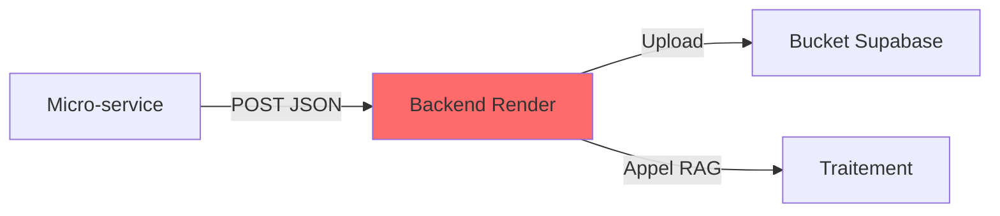
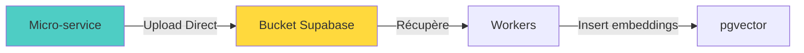
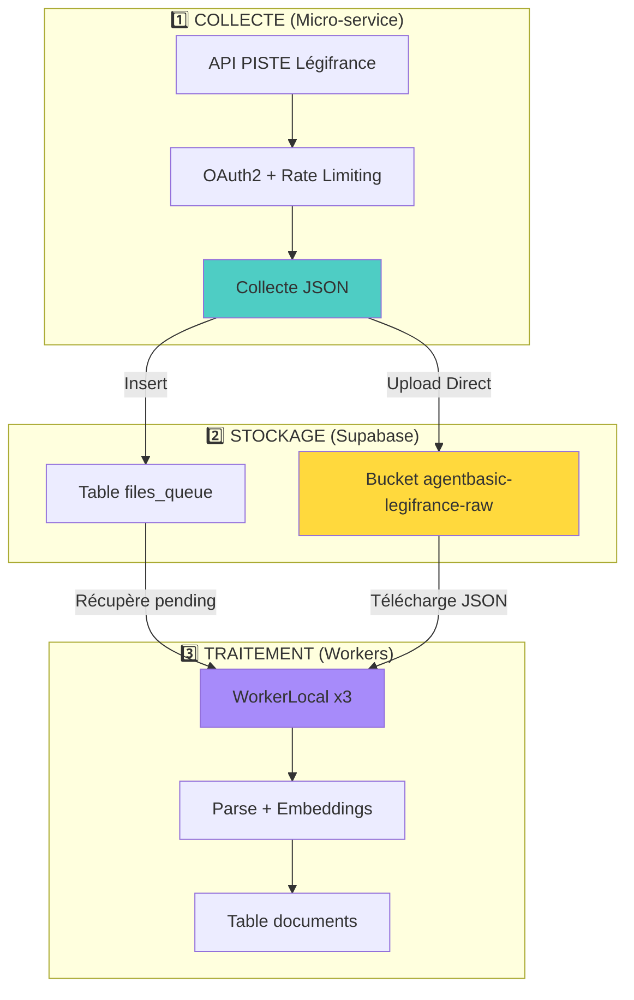

# 🏛️ MICRO-SERVICE LÉGIFRANCE - Upload Direct + Contrôle Frontend

**Date** : 13 octobre 2025  
**Version** : 2.6 PERSISTENCE SCHEDULER + UPLOAD DIRECT + CONTRÔLE FRONTEND  
**Status** : ✅ **PERSISTENCE ÉTAT + REDÉMARRAGE AUTO + CONTRÔLE TOTAL**

---

## 🎯 Rôle du Micro-Service

**Responsabilité** : **COLLECTEUR UNIQUEMENT**

```
Micro-service Légifrance
    ↓
Collecte JSON depuis API PISTE
    ↓
Upload DIRECT vers Bucket Supabase ✅
    ↓
Workers récupèrent et traitent
```

**CE QU'IL FAIT** :
- ✅ Authentification OAuth2 avec API PISTE
- ✅ Collecte documents juridiques (16 codes)
- ✅ Upload DIRECT vers bucket Supabase
- ✅ Gestion rate limiting (60 req/s)
- ✅ **INSERT AUTOMATIQUE dans `files_queue`** (~200-300 docs/min en MASSIVE) ← **MAINTIEN AUTO !**
- ✅ **Contrôle START/STOP** : Contrôlable depuis le frontend (via backend proxy)
- ✅ **Modes MASSIVE/MAINTENANCE** : Changement dynamique via frontend

**CE QU'IL NE FAIT PAS** :
- ❌ Parsing/extraction texte (Workers)
- ❌ Génération embeddings (Workers)
- ❌ Recherche sémantique (Backend)
- ❌ Appels au backend

---

## 🔄 FLUX AVANT vs APRÈS

### **AVANT (v1.0)** ❌ **PROBLÉMATIQUE**



**Problèmes** :
- ❌ Backend sollicité constamment
- ❌ Logs backend pollués
- ❌ Double hop (latence)
- ❌ Coût CPU backend

**Code** :
```python
# ❌ ANCIEN CODE
upload_response = await self.http_client.post(
    f"{self.backend_url}/api/v3/storage/bucket-upload",  # ❌ Passe par backend
    json={...}
)

rag_response = await self.http_client.post(
    f"{self.backend_url}/api/v3/rag/ingest-legifrance",  # ❌ Sollicite backend
    json={...}
)
```

---

### **APRÈS (v2.0)** ✅ **OPTIMISÉ**



**Avantages** :
- ✅ Backend libre (plus sollicité)
- ✅ Logs backend propres
- ✅ Upload direct (latence réduite)
- ✅ Micro-service autonome
- ✅ Scalabilité meilleure

**Code** :
```python
# ✅ NOUVEAU CODE
self.supabase_client = create_client(url, service_role_key)

# Upload direct vers bucket
self.supabase_client.storage.from_("agentbasic-legifrance-raw").upload(
    path=bucket_path,
    file=json_content.encode('utf-8'),
    file_options={"content-type": "application/json", "upsert": "true"}
)

# Insert dans files_queue pour workers
self.supabase_client.table('files_queue').insert({
    "file_path": bucket_path,
    "bucket_id": "agentbasic-legifrance-raw",
    "status": "pending"
}).execute()
```

---

## 📊 Architecture Simplifiée



---

## 🔧 Modifications Appliquées

### **1. supabase_service.py** ✅

**Changements** :
```python
# ✅ Import client Supabase
from supabase import create_client, Client

# ✅ Client direct (pas HTTP)
self.supabase_client = create_client(url, service_role_key)

# ✅ Upload direct
self.supabase_client.storage.from_("bucket").upload(...)

# ✅ Insert files_queue direct
self.supabase_client.table('files_queue').insert({...})
```

**Code supprimé** :
```python
# ❌ SUPPRIMÉ
- await http_client.post(f"{backend}/bucket-upload")  # Plus nécessaire
- await http_client.post(f"{backend}/ingest-legifrance")  # Plus nécessaire
- search_similar_documents()  # Code mort
- get_collection_stats()  # Code mort
- get_recent_urbanisme_docs()  # Code mort
```

---

## 🎯 Modes de Fonctionnement (v2.1)

### **Mode MASSIVE vs MAINTENANCE** ⚡

Les deux modes utilisent **EXACTEMENT les mêmes filtres** (85 mots-clés + 16 codes + 8 groupes prioritaires), mais avec des stratégies différentes :

| Aspect | Mode MASSIVE | Mode MAINTENANCE |
|--------|--------------|------------------|
| **Objectif** | Création DB initiale | Mise à jour incrémentale |
| **Stratégie** | Task asyncio continue | CRON toutes les 2h |
| **Pagination** | ⚠️ **Infinie** (continue) | ✅ **1 page max** par keyword/code |
| **Date Filter** | ❌ Aucun (tout l'historique) | ✅ **7 derniers jours** |
| **Docs/Groupe** | ⚠️ Illimité (milliers) | ✅ **Max 50** |
| **Docs/Job** | ⚠️ Illimité | ✅ **~400 max** (8 groupes × 50) |
| **Filtres** | ✅ 85 mots-clés + 16 codes + 8 groupes | ✅ **IDENTIQUES** |
| **Déduplication** | ✅ `_is_architecture_relevant()` | ✅ **IDENTIQUE** |
| **Upload** | ✅ Direct Supabase | ✅ **IDENTIQUE** |

### **Implémentation**

**Mode MASSIVE** :
```python
# Méthode: massive_architecture_siphon()
# - Pagination infinie (max_pages=None)
# - Pas de date filter
# - Collecte TOUT l'historique
await legifrance_service.massive_architecture_siphon(
    start_page=1,
    max_pages=None  # ⚠️ Continue jusqu'à épuisement
)
```

**Mode MAINTENANCE** :
```python
# Méthode: maintenance_architecture_collection()
# - Pagination limitée (1 page par keyword/code)
# - Date filter (7 derniers jours)
# - Collecte nouveaux docs uniquement
await legifrance_service.maintenance_architecture_collection(
    max_docs_per_group=50  # ✅ Limite stricte
)
```

### **Résultat**

| Mesure | Mode MASSIVE | Mode MAINTENANCE |
|--------|--------------|------------------|
| **Durée Job** | ⚠️ Continu (heures/jours) | ✅ ~5-10min |
| **Docs/Job** | ⚠️ Milliers | ✅ ~400 max |
| **Requêtes API** | ⚠️ ~1M/jour | ✅ ~100/job (800/jour) |
| **Upload Bucket** | ⚠️ ~100k fichiers | ✅ ~400/job (3.2k/jour) |
| **Quota Utilisé** | ⚠️ 93.75% (alerte) | ✅ <1% |

---

## 📋 Format JSON Bucket

**Structure conforme Workers** :
```json
{
  "legifrance_data": {
    "id": "LEGITEXT000006074075",
    "title": "Code de l'urbanisme",
    "nature": "CODE",
    "content": "...",
    "sections": [...],
    "articles": [...]
  },
  "collection_metadata": {
    "collected_at": "2025-10-11T22:00:00Z",
    "api_version": "2.4.2",
    "category": "architecture_urbanisme",
    "source": "legifrance_piste"
  }
}
```

**Compatible avec** :
- ✅ WorkerLocal (parsing existant)
- ✅ WorkerLocal Chunk (parsing identique)

---

## 🚀 Déploiement

### **Render Auto-Deploy**

```bash
# Push vers dev déclenche auto-deploy
git push origin dev

# Vérification
# Dashboard Render → micro-service-data-legifrance-piste
# Logs: "✅ SupabaseService initialisé (Upload direct vers bucket)"
```

### **Test Upload Direct**

```bash
# Endpoint test
POST /collect/manual

# Logs attendus
"✅ Document uploadé DIRECT vers bucket"
"✅ Fichier ajouté à files_queue"

# PAS dans logs backend
❌ Plus de "POST /api/v3/storage/bucket-upload"
❌ Plus de "POST /api/v3/rag/ingest-legifrance"
```

---

## 📊 Métriques

### **Performance**

| Métrique | Avant | Après | Gain |
|----------|-------|-------|------|
| **Latence upload** | ~200ms | ~100ms | ✅ -50% |
| **CPU backend** | Sollicité | Libre | ✅ 100% |
| **Logs backend** | Pollués | Propres | ✅ Clean |
| **Hops** | 2 (micro→backend→bucket) | 1 (micro→bucket) | ✅ -50% |

### **Scalabilité**

- ✅ Micro-service peut scaler indépendamment
- ✅ Backend pas impacté par collecte massive
- ✅ Workers traitent à leur rythme

---

## 🔐 Sécurité

### **Service Role Key** ✅

**Configuration** :
```python
# Micro-service utilise service_role_key
SUPABASE_SERVICE_ROLE_KEY=eyJhbGciOiJIUzI1NiIs...

# Permissions:
# ✅ Storage: Upload vers bucket (public bucket)
# ✅ Database: INSERT dans files_queue
```

**RLS** :
- `files_queue` : RLS ON, service_role peut INSERT
- Bucket : Public (lecture), service_role peut WRITE

---

## 🎯 Séparation des Responsabilités

| Service | Rôle | Bucket | Database |
|---------|------|--------|----------|
| **Micro-service** | Collecte + Upload | ✅ WRITE | ✅ INSERT files_queue |
| **Workers** | Parse + Embeddings | ✅ READ | ✅ INSERT documents/chunks |
| **Backend** | Recherche RAG | ❌ Pas accès | ✅ READ documents/chunks |

**Architecture claire** :
- Micro-service → Bucket (collecte)
- Workers → Bucket → pgvector (traitement)
- Backend → pgvector (recherche)

---

## ✅ Résumé

| Aspect | Status |
|--------|--------|
| **Upload direct** | ✅ Implémenté |
| **files_queue auto** | ✅ Implémenté |
| **Code backend supprimé** | ✅ Plus d'appels HTTP |
| **Code mort nettoyé** | ✅ 3 fonctions supprimées |
| **Performance** | ✅ -50% latence |
| **Backend libre** | ✅ Plus sollicité |

---

## 🔄 Persistance de l'État (v2.4.0)

### Gestionnaire d'état : `scheduler_state.py`

**Fichier** : `app/scheduler/scheduler_state.py` (nouveau en v2.4.0)

**Classe** : `SchedulerStateManager`

**Méthodes** :
- `save_state(running: bool, mode: str)` : Sauvegarde l'état dans `/tmp/scheduler_state.json`
- `load_state() -> dict` : Charge l'état sauvegardé (ou état par défaut si absent)
- `clear_state()` : Supprime le fichier d'état (reset)

**Format du fichier JSON** :
```json
{
  "running": true,
  "mode": "MAINTENANCE"
}
```

### Workflow de persistance

**Au boot (`main.py` ligne 60-76) :**
```python
# 1. Créer le scheduler (toujours)
scheduler = CollectorScheduler(...)

# 2. Charger l'état sauvegardé
saved_state = SchedulerStateManager.load_state()

# 3. Restaurer le mode
if saved_state.get("mode"):
    scheduler.siphonnage_mode = saved_state["mode"]

# 4. Redémarrer si l'état était RUNNING
if saved_state.get("running", False):
    await scheduler.start()  # ✅ Redémarre automatiquement
else:
    # ⏸️ Reste arrêté (contrôle manuel)
```

**Dans les endpoints :**
- `/aspirage/start` (ligne 216) : `save_state(running=True, mode=...)`
- `/aspirage/stop` (ligne 270) : `save_state(running=False, mode=...)`
- `/siphonnage/mode` (ligne 473) : `save_state(running=..., mode=nouveau_mode)`

### Avantages

✅ **Résilience** : Service survit aux crashs/redémarrages  
✅ **Simplicité** : Format JSON lisible, 1 seul fichier  
✅ **Performance** : Lecture/écriture instantanée  
✅ **Compatibilité Render** : `/tmp/` accessible en écriture (vs `/app/` read-only)  
✅ **Contrôle total** : Frontend maître de l'état du service  

---

## 📜 Changelog

### **v2.1.0 - MODE MAINTENANCE UNIFIÉ** (11 octobre 2025 23:30 UTC)

**Objectif** : Unifier les filtres MASSIVE et MAINTENANCE pour garantir la même qualité de collecte

**Modifications** :
- ✅ Nouvelle méthode `maintenance_architecture_collection()` dans `legifrance_service.py`
- ✅ Nouvelle méthode `_collect_priority_group_limited()` avec pagination limitée (1 page max)
- ✅ Job scheduler `_run_collection_job()` appelle désormais `maintenance_architecture_collection()`
- ✅ **IDENTIQUE à MASSIVE** : 85 mots-clés + 16 codes + 8 groupes prioritaires
- ✅ **MÊME filtre** : `_is_architecture_relevant()` (pertinence intelligente)
- ✅ **MÊME déduplication** : `_deduplicate_documents()` (5 stratégies ID)
- ✅ **Limite stricte** : 50 docs/groupe (max 400/job vs illimité en MASSIVE)
- ✅ **Date filter** : 7 derniers jours (évite doublons, nouveaux docs uniquement)

**Impact** :
- ✅ Mode MAINTENANCE collecte **la même qualité** que MASSIVE (mêmes filtres, même logique)
- ✅ Quotas utilisés : <1% (vs 93.75% en MASSIVE)
- ✅ Durée job : ~5-10min (vs heures/jours en MASSIVE)
- ✅ Maintenance DB = Création initiale (qualité identique)

**Fichiers modifiés** :
- `app/services/legifrance_service.py` : +110 lignes (nouvelle méthode)
- `app/scheduler/collector_scheduler.py` : -77 lignes, +36 lignes (simplifié)

---

### **v2.0.0 - UPLOAD DIRECT** (11 octobre 2025 23:00 UTC)

**Objectif** : Upload direct Supabase Storage (plus de passage par backend)

**Modifications** :
- ✅ Client Supabase direct dans micro-service
- ✅ Upload bucket sans backend
- ✅ Insert `files_queue` automatique
- ❌ Suppression 3 fonctions code mort (`search_similar_documents`, `get_collection_stats`, `get_recent_urbanisme_docs`)
- ❌ Suppression endpoint backend `/api/v3/storage/bucket-upload`

**Impact** :
- ✅ -50% latence (1 hop vs 2)
- ✅ Backend libéré (plus sollicité)
- ✅ Logs backend propres

---

**📅 Dernière mise à jour** : 12 octobre 2025 13:00 UTC  
**✅ Status** : PERSISTANCE ÉTAT - Contrôle total depuis frontend ✅

### 📝 CHANGELOG v2.4.0

**12 octobre 2025** - Persistance État Scheduler
- ✅ **Persistance intelligente** : Le scheduler se rappelle de son état (running/stopped + mode) après redémarrage/crash
- ✅ **Fichier state** : `/tmp/scheduler_state.json` - Format JSON simple `{running: bool, mode: str}`
- ✅ **Restauration automatique** : Si crash → Redémarre automatiquement si l'état était RUNNING
- ✅ **Boot intelligent** : Démarre ARRÊTÉ par défaut (contrôle manuel), sauf si état sauvegardé = RUNNING
- ✅ **Sauvegarde automatique** : Chaque action (/start, /stop, /mode) sauvegarde l'état
- ✅ **Health check optimisé** : Fix fuite mémoire threads (suppression `asyncio.to_thread`)
- ✅ **OOM fix** : Plus de crash après 1052 requêtes (workers Gunicorn)

**Fichiers modifiés :**
- `app/scheduler/scheduler_state.py` (nouveau) : Gestionnaire de persistance avec `save_state()` et `load_state()`
- `app/main.py` (ligne 60-76) : Chargement de l'état au boot + restauration mode
- `app/main.py` (ligne 216, 270, 473) : Sauvegarde état dans `/aspirage/start`, `/aspirage/stop`, `/siphonnage/mode`
- `app/services/supabase_service.py` (ligne 63-66) : Health check simplifié sans threads

**Scénario d'exemple :**
```
1. Boot initial → ARRÊTÉ (pas de state)
2. Frontend START → Démarre + Save {running: true, mode: MAINTENANCE}
3. Crash/Redémarrage → Lit state → Redémarre AUTO en MAINTENANCE ✅
4. Frontend STOP → Arrête + Save {running: false, mode: MAINTENANCE}
5. Crash/Redémarrage → Lit state → RESTE ARRÊTÉ ✅
```

### 📝 CHANGELOG v2.3.0

**11 octobre 2025** - Contrôle START/STOP
- ✅ **Endpoint `/aspirage/stop`** : Arrêt manuel de la collecte
- ✅ **Endpoint `/aspirage/status`** : Récupération du statut (running/stopped)
- ✅ **Bouton dynamique START/STOP** : Interface frontend adaptative selon l'état
- ✅ **Confirmations modales** : Modales détaillées pour START et STOP
- ✅ **Proxy backend** : Exposition sécurisée des nouveaux endpoints

### 📝 CHANGELOG v2.2.0

**11 octobre 2025** - Architecture Unifiée
- ✅ **Filtres urbanisme intégrés** : Mots-clés urbanisme ajoutés aux filtres MASSIVE/MAINTENANCE
- ✅ **Endpoint `/aspirage/urbanisme` supprimé** : Redondant, filtres maintenant inclus
- ✅ **Frontend nettoyé** : Bouton urbanisme spécialisé supprimé
- ✅ **Architecture simplifiée** : 2 modes uniques avec filtres complets

