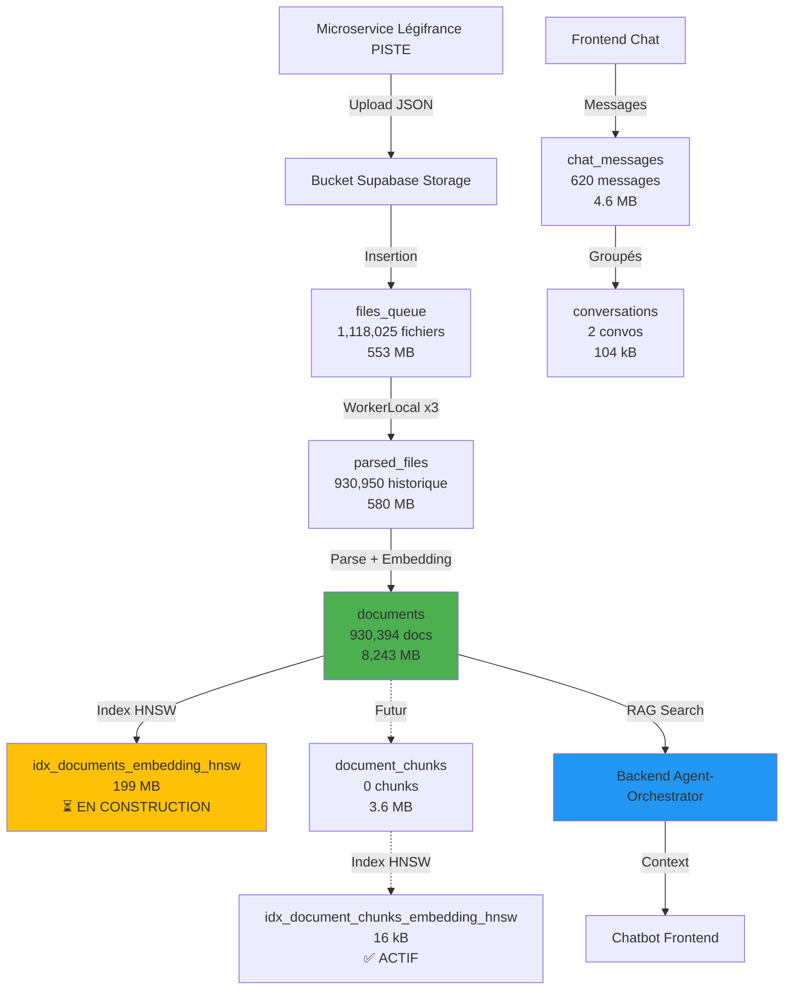

# 🗄️ STRUCTURE DES TABLES - Vue Complète

**Date de création** : 13 octobre 2025  
**Dernière mise à jour** : 13 octobre 2025 12:45 UTC  
**Version** : 1.0  
**Status** : ✅ **DOCUMENTÉ** - 930,394 documents, 9.5 GB total

---

## 🎯 Vue d'Ensemble

Ce document décrit la structure complète des tables Supabase utilisées par ArchiReg, leur rôle, leurs colonnes, et leurs tailles.

---

## 📊 Flux de Données Complet



---

## 📋 Tables Principales

### 1️⃣ `documents` - CŒUR DU SYSTÈME RAG

**Rôle** : Stocke les documents juridiques Légifrance avec leurs embeddings pour la recherche sémantique.

**Statistiques** :
- **Rows** : 930,394 documents
- **Taille table** : 504 MB (données brutes)
- **Taille index** : 4,021 MB (dont 199 MB HNSW en construction)
- **TOTAL** : 8,243 MB

**Colonnes principales** :

| Colonne | Type | Description | Exemple |
|---------|------|-------------|---------|
| `id` | uuid | Identifiant unique | `a1b2c3d4-...` |
| `title` | text | Titre du document | "Code de l'urbanisme - Article L151-1" |
| `content` | text | Texte complet juridique | "Le plan local d'urbanisme..." |
| `summary` | text | Résumé (nullable) | "Définition du PLU..." |
| `embedding` | vector(768) | Vecteur GGUF Solon Base | `[0.123, -0.456, ...]` |
| `metadata` | jsonb | Métadonnées (vide) | `{}` |
| `extra_data` | jsonb | Métadonnées Workers | `{"source": "workerlocal"}` |
| `file_path` | text | Chemin bucket Supabase | `batch_001/doc_123.json` |
| `upload_date` | timestamptz | Date d'upload | `2025-10-12 15:30:00+00` |

**Index** :
- ✅ `PRIMARY KEY (id)` : B-tree
- ✅ `UNIQUE (file_path)` : B-tree
- ⏳ `idx_documents_embedding_hnsw` : **HNSW (en construction)** - 199 MB

**Utilisation** :
- Workers : INSERT après génération embedding
- Backend : SELECT avec recherche vectorielle (`embedding <=> query::vector`)
- Frontend : Lecture via Backend (jamais direct)

---

### 2️⃣ `files_queue` - QUEUE DE TRAITEMENT

**Rôle** : File d'attente pour le traitement des fichiers JSON uploadés par le microservice Légifrance.

**Statistiques** :
- **Rows** : 1,118,025 fichiers
- **Taille table** : 218 MB
- **Taille index** : 335 MB
- **TOTAL** : 553 MB

**Colonnes principales** :

| Colonne | Type | Description | Exemple |
|---------|------|-------------|---------|
| `id` | bigint | ID séquentiel (pagination) | `1`, `2`, `3`... |
| `file_path` | text | Chemin bucket Supabase | `batch_001/doc_123.json` |
| `bucket_id` | text | Nom du bucket | `agentbasic-legifrance-raw` |
| `file_size` | bigint | Taille en bytes | `12345` |
| `processed` | boolean | Fichier traité ? | `true`/`false` |
| `processed_at` | timestamptz | Date traitement | `2025-10-12 15:30:00+00` |
| `worker_id` | text | Worker qui a traité | `worker-local-1` |
| `status` | text | État actuel | `pending`, `processing`, `completed`, `failed` |

**Index** :
- ✅ `PRIMARY KEY (id)` : B-tree (pagination efficace)
- ✅ `UNIQUE (file_path)` : B-tree (évite doublons)

**Utilisation** :
- Microservice : INSERT après upload bucket
- Workers : SELECT WHERE processed = false ORDER BY id LIMIT 1000
- Backend : Lecture stats via Edge Function `admin-stats`

**Progression** : 930k/1.1M traités = **83.2% complété**

---

### 3️⃣ `parsed_files` - HISTORIQUE PARSING

**Rôle** : Trace l'historique de tous les fichiers parsés par les Workers.

**Statistiques** :
- **Rows** : 930,950 fichiers
- **Taille table** : 208 MB
- **Taille index** : 372 MB
- **TOTAL** : 580 MB

**Colonnes principales** :

| Colonne | Type | Description | Exemple |
|---------|------|-------------|---------|
| `id` | uuid | Identifiant unique | `a1b2c3d4-...` |
| `file_path` | text | Chemin bucket (unique) | `batch_001/doc_123.json` |
| `legifrance_id` | text | ID Légifrance (nullable) | `LEGIARTI000006417896` |
| `content_hash` | text | Hash MD5 du contenu | `a1b2c3d4e5f6...` |
| `parsed_at` | timestamptz | Date parsing | `2025-10-12 15:30:00+00` |
| `status` | text | État parsing | `processing`, `completed`, `failed` |
| `worker_id` | text | Worker responsable | `worker-local-1` |

**Index** :
- ✅ `PRIMARY KEY (id)` : B-tree
- ✅ `UNIQUE (file_path)` : B-tree (évite double parsing)

**Utilisation** :
- Workers : INSERT après parsing réussi
- Backend : Vérifier si fichier déjà parsé avant traitement
- Admin : Stats historiques

---

### 4️⃣ `document_chunks` - CHUNKING GRANULAIRE (FUTUR)

**Rôle** : Stockera les chunks granulaires avec embeddings pour recherche fine.

**Statistiques** :
- **Rows** : 0 (vide, futur WorkerLocal Chunk)
- **Taille table** : 0 bytes
- **Taille index** : 3,648 kB (16 kB HNSW)
- **TOTAL** : 3.6 MB

**Colonnes principales** :

| Colonne | Type | Description | Exemple |
|---------|------|-------------|---------|
| `id` | uuid | Identifiant unique | `a1b2c3d4-...` |
| `document_id` | uuid | Lien vers documents.id | `uuid-parent` |
| `chunk_index` | int | Position chunk (0, 1, 2...) | `0` |
| `content` | text | Contenu chunk (500-1000 chars) | "Article L151-1..." |
| `embedding` | vector(768) | Vecteur GGUF chunk | `[0.123, -0.456, ...]` |
| `metadata` | jsonb | Métadonnées chunk | `{"section": "Article"}` |

**Index** :
- ✅ `PRIMARY KEY (id)` : B-tree
- ✅ `idx_document_chunks_embedding_hnsw` : **HNSW (ACTIF)** - 16 kB

**Utilisation future** :
- WorkerLocal Chunk : INSERT chunks + embeddings
- Backend : Recherche fine avec RAG multi-niveaux (doc entier + chunks)

---

### 5️⃣ `chat_messages` - HISTORIQUE CONVERSATIONNEL

**Rôle** : Stocke l'historique complet des conversations utilisateur ↔ assistant.

**Statistiques** :
- **Rows** : 620 messages
- **Taille table** : 2,008 kB
- **Taille index** : 1,088 kB
- **TOTAL** : 4.6 MB

**Colonnes principales** :

| Colonne | Type | Description | Exemple |
|---------|------|-------------|---------|
| `id` | uuid | Identifiant unique | `a1b2c3d4-...` |
| `user_id` | uuid | Utilisateur propriétaire | `uuid-user` |
| `conversation_id` | uuid | Lien conversation | `uuid-convo` |
| `message` | text | Contenu message | "Code de l'urbanisme" |
| `role` | text | Rôle (user/assistant/system) | `user` |
| `model_used` | text | Modèle LLM utilisé | `openai/gpt-oss-120b` |
| `tokens_used` | int | Tokens consommés | `1234` |
| `response_time_ms` | int | Temps réponse | `3500` |
| `metadata` | jsonb | Métadonnées diverses | `{"rag_docs": 3}` |

**Index** :
- ✅ `PRIMARY KEY (id)` : B-tree
- ✅ Foreign Keys : `user_id`, `conversation_id`

**Utilisation** :
- Frontend : INSERT après chaque message
- Backend : SELECT pour contexte conversation
- Admin : Stats usage LLM

---

## 📊 Autres Tables Importantes

### `conversations`
- **Rows** : 2
- **Taille** : 104 kB
- **Rôle** : Grouper les messages par conversation
- **Colonnes** : id, user_id, project_id, title, message_count, total_tokens

### `projects`
- **Rows** : 0 (vide)
- **Taille** : 88 kB
- **Rôle** : Gestion projets architecture (futur)
- **Colonnes** : id, name, address, plu_zone, building_permit_required

### `users`
- **Rows** : 0 (vide)
- **Taille** : 64 kB
- **Rôle** : Authentification utilisateurs
- **Colonnes** : id, email, username, subscription_tier, api_usage_count

### `ingestion_metrics`
- **Rows** : 13,653
- **Taille** : 2 MB
- **Rôle** : Métriques workers (batch, temps traitement)
- **Colonnes** : id, worker_id, batch_id, processed_files, processing_time_ms

### `system_alerts`
- **Rows** : 242
- **Taille** : 120 kB
- **Rôle** : Alertes système (erreurs, warnings)
- **Colonnes** : id, alert_type, severity, message, resolved

---

## 🔍 Index HNSW - État Actuel (13 oct 2025)

### `idx_documents_embedding_hnsw`

**État** : ⏳ **EN CONSTRUCTION**

```json
{
  "index_name": "idx_documents_embedding_hnsw",
  "current_size": "199 MB",
  "is_valid": false,
  "is_ready": false,
  "total_rows": 930701,
  "status": "⏳ EN CONSTRUCTION - Encore quelques minutes",
  "time_elapsed": "49 minutes",
  "estimated_remaining": "5-10 minutes"
}
```

**Phases de Construction** :

```
Phase 1: Scan initial (lecture séquentielle)      [████████░░] 80% complété
Phase 2: Build HNSW graph (construction graphe)   [██████░░░░] 60% ← ACTUEL
Phase 3: Finalisation (optimisation connexions)   [░░░░░░░░░░] 0%
Phase 4: Validation (activation index)            [░░░░░░░░░░] 0%
```

**Quand `is_valid = true` :**
- ✅ PostgreSQL utilisera l'index automatiquement
- ✅ Recherche <1s sur 930k docs
- ✅ Chatbot instantané avec RAG complet

### `idx_document_chunks_embedding_hnsw`

**État** : ✅ **ACTIF**

```json
{
  "index_name": "idx_document_chunks_embedding_hnsw",
  "current_size": "16 kB",
  "is_valid": true,
  "is_ready": true,
  "total_rows": 0,
  "status": "✅ ACTIF - Prêt pour chunks futurs"
}
```

---

## 📈 Statistiques Globales

### Données RAG

| Table | Documents | Taille | Index HNSW | Status |
|-------|-----------|--------|------------|--------|
| `documents` | 930,394 | 504 MB | 199 MB | ⏳ En construction |
| `document_chunks` | 0 | 0 bytes | 16 kB | ✅ Actif |

### Progression Ingestion

| Métrique | Valeur | Taux |
|----------|--------|------|
| **Fichiers queue** | 1,118,025 | 100% |
| **Fichiers parsés** | 930,950 | 83.2% |
| **Documents RAG** | 930,394 | 83.2% |
| **Restants** | 187,075 | 16.8% |

### Utilisation Espace

| Catégorie | Taille | Pourcentage |
|-----------|--------|-------------|
| **Table documents** | 504 MB | 5.3% |
| **Index documents** | 4,021 MB | 42.3% |
| **Table files_queue** | 218 MB | 2.3% |
| **Index files_queue** | 335 MB | 3.5% |
| **Table parsed_files** | 208 MB | 2.2% |
| **Index parsed_files** | 372 MB | 3.9% |
| **Autres tables** | ~3,842 MB | 40.5% |
| **TOTAL DATABASE** | **~9,500 MB** | **100%** |

---

## 🔄 Workflow Complet

### 1. Collecte (Microservice Légifrance)

```
Microservice PISTE
  → Upload JSON vers bucket Supabase Storage
  → INSERT INTO files_queue (file_path, bucket_id, status='pending')
```

### 2. Parsing (WorkerLocal x3)

```
WorkerLocal
  → SELECT FROM files_queue WHERE processed = false ORDER BY id LIMIT 1000
  → Parse JSON + Génération embedding GGUF
  → INSERT INTO documents (title, content, embedding, extra_data)
  → INSERT INTO parsed_files (file_path, status='completed')
  → UPDATE files_queue SET processed = true, status='completed'
```

### 3. Recherche Sémantique (Backend)

```
Frontend
  → POST /api/v3/chat/completions {"message": "Code urbanisme"}
  
Backend Orchestrator
  → Génère embedding query avec GGUF
  → SELECT FROM documents 
     WHERE embedding <=> query::vector < 0.3
     ORDER BY distance
     LIMIT 8
     (Utilise index HNSW quand is_valid = true)
  → Retourne top 8 documents similaires
  → Injecte contexte dans prompt LLM
  → Stream réponse vers frontend
```

### 4. Chunking Futur (WorkerLocal Chunk)

```
WorkerLocal Chunk (pas encore actif)
  → SELECT FROM documents WHERE non chunké
  → Découpe en chunks 500-1000 chars
  → Génère embedding par chunk
  → INSERT INTO document_chunks (document_id, chunk_index, content, embedding)
```

---

## 🎯 Tables par Catégorie

### 📚 RAG & Embeddings

| Table | Rows | Taille | Rôle |
|-------|------|--------|------|
| `documents` | 930,394 | 8,243 MB | Documents + embeddings contexte |
| `document_chunks` | 0 | 3.6 MB | Chunks + embeddings granulaires (futur) |

### 📥 Ingestion & Queue

| Table | Rows | Taille | Rôle |
|-------|------|--------|------|
| `files_queue` | 1,118,025 | 553 MB | Queue traitement fichiers |
| `parsed_files` | 930,950 | 580 MB | Historique parsing |

### 💬 Chat & Utilisateurs

| Table | Rows | Taille | Rôle |
|-------|------|--------|------|
| `chat_messages` | 620 | 4.6 MB | Messages chat |
| `conversations` | 2 | 104 kB | Groupement conversations |
| `users` | 0 | 64 kB | Authentification |

### 🏗️ Projets Architecture

| Table | Rows | Taille | Rôle |
|-------|------|--------|------|
| `projects` | 0 | 88 kB | Projets architecture (futur) |
| `templates` | 0 | 64 kB | Templates documents (futur) |

### 📊 Monitoring & Métriques

| Table | Rows | Taille | Rôle |
|-------|------|--------|------|
| `ingestion_metrics` | 13,653 | 2 MB | Métriques workers |
| `system_alerts` | 242 | 120 kB | Alertes système |
| `timeline_cache` | 17 | 72 kB | Cache timeline 24h |
| `realtime_metrics` | 1 | 32 kB | Compteurs temps réel |

---

## ⚡ Optimisations Appliquées

### Index HNSW (13 oct 2025)

**Objectif** : Accélérer recherche vectorielle de 30s+ → <1s

**Index créés** :
```sql
-- documents.embedding (930k docs)
CREATE INDEX CONCURRENTLY idx_documents_embedding_hnsw 
ON documents USING hnsw (embedding vector_cosine_ops)
WITH (m = 16, ef_construction = 64);

-- document_chunks.embedding (futur)
CREATE INDEX CONCURRENTLY idx_document_chunks_embedding_hnsw 
ON document_chunks USING hnsw (embedding vector_cosine_ops)
WITH (m = 16, ef_construction = 64);
```

**État actuel** :
- ⏳ `idx_documents_embedding_hnsw` : EN CONSTRUCTION (199 MB, ~60-70% fait)
- ✅ `idx_document_chunks_embedding_hnsw` : ACTIF (16 kB)

**Gains attendus** :
- Temps : 30s+ → <1s (**100x-1000x**)
- Calculs : 930,000 → ~150 (**6,200x**)
- Coverage : 21% → 100% (**479%**)

---

## 🔧 Commandes Utiles

### Vérifier l'état des index HNSW

```sql
SELECT 
    i.relname as index_name,
    pg_size_pretty(pg_relation_size(i.oid)) as size,
    idx.indisvalid as is_valid,
    idx.indisready as is_ready
FROM pg_class i
JOIN pg_index idx ON i.oid = idx.indexrelid
WHERE i.relname LIKE '%hnsw%';
```

### Statistiques des tables principales

```sql
SELECT 
    tablename,
    pg_size_pretty(pg_total_relation_size('public.'||tablename)) as total_size,
    (SELECT reltuples::bigint FROM pg_class WHERE relname = tablename) as estimated_rows
FROM pg_tables
WHERE schemaname = 'public'
ORDER BY pg_total_relation_size('public.'||tablename) DESC
LIMIT 10;
```

### Progression ingestion

```sql
SELECT 
    COUNT(*) FILTER (WHERE processed = true) as completed,
    COUNT(*) FILTER (WHERE processed = false) as pending,
    COUNT(*) as total,
    ROUND(100.0 * COUNT(*) FILTER (WHERE processed = true) / COUNT(*), 2) as pct_done
FROM files_queue;
```

---

## 📚 Références

- [PostgreSQL pg_class](https://www.postgresql.org/docs/current/catalog-pg-class.html)
- [PostgreSQL pg_index](https://www.postgresql.org/docs/current/catalog-pg-index.html)
- [pgvector HNSW](https://github.com/pgvector/pgvector#hnsw)
- [CREATE INDEX CONCURRENTLY](https://www.postgresql.org/docs/current/sql-createindex.html#SQL-CREATEINDEX-CONCURRENTLY)

---

**🎯 RÉSUMÉ** : 17 tables, 930k documents RAG, 9.5 GB, index HNSW en construction (5-10 min restantes)

