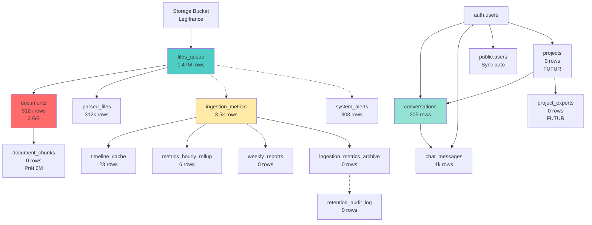

# 📊 TABLES EXPLICATIVES - GUIDE COMPLET

**Date** : 14 octobre 2025  
**Version** : 1.0.0  
**Objectif** : Expliquer TOUTES les tables, leur rôle, leurs liens et éviter toute confusion

---

## 🎯 TABLES PAR CATÉGORIE

### **📦 CATÉGORIE 1 : LÉGIFRANCE RAG (4 TABLES)**

#### **1. files_queue** 📋
- **Rows** : 1,477,661 (1.47M)
- **Size** : 621 MB
- **Rôle** : Queue de traitement des fichiers JSON depuis Storage
- **Lien** : → `storage.objects` (bucket Légifrance)
- **Utilisé par** : 
  - WorkerLocal (lecture pour traiter)
  - Micro-service Légifrance (écriture auto-sync)
- **Colonnes clés** :
  - `file_path` : Chemin du fichier dans bucket
  - `status` : pending/processing/completed/failed
  - `processed` : boolean (traité ou non)
  - `worker_id` : Quel worker traite ce fichier
- **RLS** : Service role only (workers/backend)

#### **2. documents** 📄
- **Rows** : 312,205 (312k)
- **Size** : 3,085 MB (3 GB) ← **Plus grosse table !**
- **Rôle** : Documents Légifrance avec embeddings (contexte global)
- **Lien** : 
  - ← `files_queue` (créés après parsing)
  - → `document_chunks` (parent pour chunks granulaires)
- **Utilisé par** :
  - WorkerLocal (écriture après parsing)
  - Backend RAG (lecture pour recherche sémantique)
- **Colonnes clés** :
  - `content` : Texte complet du document
  - `embedding` : Vector 768 dims (pgvector)
  - `user_id` : NULL pour Légifrance (publics), UUID pour docs users
  - `file_path` : Lien vers bucket
- **Index** : 
  - `idx_documents_embedding_hnsw` : 1424 MB (recherche vectorielle rapide)
- **RLS** : Users voient leurs docs OU docs publics (user_id IS NULL)

#### **3. parsed_files** 🔐
- **Rows** : 312,139 (312k)
- **Size** : 442 MB
- **Rôle** : Anti-duplication (évite de parser 2 fois le même fichier)
- **Lien** : → `documents` (via file_path)
- **Utilisé par** :
  - WorkerLocal (vérifie si déjà parsé avant traitement)
- **Colonnes clés** :
  - `file_path` : Clé unique (même fichier = même path)
  - `content_hash` : Hash SHA256 du contenu
  - `document_id` : UUID du document créé
- **RLS** : Service role only

#### **4. document_chunks** 🧩
- **Rows** : 0 (vide, prêt pour WorkerLocal Chunk)
- **Size** : 3,640 kB (3.6 MB pré-alloués)
- **Rôle** : Chunks granulaires (articles, sections) avec embeddings
- **Lien** : 
  - ← `documents` (parent via document_id)
- **Utilisé par** :
  - WorkerLocal Chunk (écriture après découpage)
  - Backend RAG futur (recherche hybride niveau 2)
- **Colonnes clés** :
  - `document_id` : UUID du document parent (peut être NULL)
  - `chunk_index` : Ordre dans le document
  - `content` : Texte du chunk
  - `embedding` : Vector 768 dims
- **Index** : Prêts pour 6M chunks (WorkerLocal Chunk pas encore lancé)
- **RLS** : Hérite des permissions du parent (documents)

---

### **💬 CATÉGORIE 2 : CHAT UTILISATEUR (2 TABLES)**

#### **5. conversations** 🗨️
- **Rows** : 205
- **Size** : 104 kB
- **Rôle** : Conversations chat (sessions)
- **Lien** : 
  - → `chat_messages` (1 conversation = N messages)
  - ← `auth.users` (via user_id)
  - → `projects` (via project_id, optionnel)
- **Utilisé par** :
  - Frontend (création conversation)
  - Backend (lecture/écriture)
- **Colonnes clés** :
  - `user_id` : UUID utilisateur (auth.users)
  - `title` : Titre de la conversation
  - `project_id` : Lien vers projet (optionnel)
- **RLS** : Users voient seulement leurs conversations

#### **6. chat_messages** 💬
- **Rows** : 1,028 (14k avant optimisation)
- **Size** : 5,392 kB (5.4 MB)
- **Rôle** : Messages chat (questions/réponses)
- **Lien** : 
  - ← `conversations` (via conversation_id)
  - ← `auth.users` (via user_id)
- **Utilisé par** :
  - Frontend (affichage chat)
  - Backend (écriture après réponse Groq)
- **Colonnes clés** :
  - `conversation_id` : UUID conversation parent
  - `user_id` : UUID utilisateur
  - `message` : Contenu du message
  - `role` : user/assistant/system
  - `model_used` : Modèle Groq utilisé
  - `tokens_used` : Consommation tokens
- **RLS** : Users voient seulement leurs messages

---

### **👤 CATÉGORIE 3 : AUTHENTIFICATION (1 TABLE)**

#### **7. users** 👥
- **Rows** : 0 (synchronisée à chaque connexion depuis auth.users)
- **Size** : 64 kB
- **Rôle** : Profils utilisateurs custom (complète auth.users)
- **Lien** : 
  - ← `auth.users` (synchro auto via backend)
  - → `conversations`, `chat_messages`, `projects` (via user_id)
- **Utilisé par** :
  - Backend auth (synchro auto à chaque connexion)
  - Backend API (récupération rôle/metadata)
- **Colonnes clés** :
  - `id` : UUID (même que auth.users.id)
  - `email` : Email utilisateur
  - `role` : admin/developer/user
  - `metadata` : JSONB (custom data)
  - `subscription_tier` : free/pro/enterprise
  - `api_usage_count` : Compteur usage API
- **RLS** : Users voient leur propre profil
- **⚠️ NE PAS SUPPRIMER** : Utilisée par backend pour sync auth + rôles

---

### **📊 CATÉGORIE 4 : MONITORING & ADMIN (7 TABLES)**

#### **8. ingestion_metrics** 📈
- **Rows** : 3,465
- **Size** : 792 kB
- **Rôle** : Métriques de parsing des workers (batch tracking)
- **Lien** : 
  - → `files_queue` (via batch tracking)
- **Utilisé par** :
  - Workers (écriture après chaque batch)
  - Admin dashboard (lecture pour graphiques)
- **Colonnes clés** :
  - `worker_id` : Quel worker a généré la métrique
  - `batch_id` : UUID du batch
  - `files_processed` : Nombre de fichiers traités
  - `success_count`, `error_count` : Compteurs
  - `processing_time_seconds` : Temps de traitement
- **RLS** : Service role + admin

#### **9. system_alerts** 🚨
- **Rows** : 303
- **Size** : 160 kB
- **Rôle** : Alertes système (workers inactifs, erreurs, etc.)
- **Lien** : Aucun (table autonome)
- **Utilisé par** :
  - pg_cron jobs (écriture via détection)
  - Admin dashboard (lecture pour affichage)
- **Colonnes clés** :
  - `alert_type` : inactive_worker/high_error_rate/stagnant_queue
  - `severity` : warning/error/critical
  - `details` : JSONB (contexte alerte)
  - `resolved_at` : Date résolution (NULL si active)
- **RLS** : Service role + admin

#### **10. timeline_cache** ⏱️
- **Rows** : 23
- **Size** : 72 kB
- **Rôle** : Cache des métriques timeline 24h (pré-calculées)
- **Lien** : 
  - ← `ingestion_metrics` (agrégation par heure)
- **Utilisé par** :
  - pg_cron (refresh toutes les 5 min)
  - Admin dashboard (lecture rapide pour graphique timeline)
- **Colonnes clés** :
  - `hour` : Heure de la métrique
  - `total_count`, `completed_count`, `failed_count` : Compteurs
- **RLS** : Service role + admin

#### **11. metrics_hourly_rollup** 📊
- **Rows** : 6
- **Size** : 56 kB
- **Rôle** : Agrégation horaire des métriques (rollup)
- **Lien** : 
  - ← `ingestion_metrics` (agrégation)
- **Utilisé par** :
  - pg_cron (refresh toutes les heures)
  - Admin dashboard (lecture pour historique long terme)
- **Colonnes clés** :
  - `hour` : Heure de la métrique
  - `total_files`, `success_rate` : Agrégats
- **RLS** : Service role + admin

#### **12. admin_metrics_snapshot** 📸
- **Rows** : 0 (vide, legacy)
- **Size** : 256 kB
- **Rôle** : Snapshot pré-calculé des métriques admin
- **Lien** : Aucun (remplacé par admin_metrics_view)
- **Utilisé par** : ⚠️ **LEGACY** - Plus utilisé (remplacé par materialized view)
- **RLS** : Service role + admin

#### **13. realtime_metrics** ⚡
- **Rows** : 0 (vide, compteurs incrémentaux)
- **Size** : 32 kB
- **Rôle** : Métriques temps réel (pattern Stripe/Vercel)
- **Lien** : Aucun (compteurs atomiques)
- **Utilisé par** : ⚠️ **FUTUR** - Pas encore implémenté
- **RLS** : Service role + admin

#### **14. weekly_reports** 📅
- **Rows** : 0 (vide, prêt pour génération)
- **Size** : 24 kB
- **Rôle** : Rapports hebdomadaires automatiques
- **Lien** : 
  - ← `ingestion_metrics` (agrégation semaine)
- **Utilisé par** :
  - pg_cron (génération lundi 06:00)
  - Admin dashboard (lecture)
- **RLS** : Service role + admin

---

### **🗄️ CATÉGORIE 5 : ARCHIVAGE & PURGE (4 TABLES)**

#### **15. ingestion_metrics_archive** 📦
- **Rows** : 0 (vide, prêt pour archivage)
- **Size** : 16 kB
- **Rôle** : Archive des métriques > 30 jours
- **Lien** : 
  - ← `ingestion_metrics` (déplacement après 30j)
- **Utilisé par** :
  - pg_cron (archivage quotidien 03:00)
- **RLS** : Service role + admin

#### **16. retention_audit_log** 📝
- **Rows** : 0 (vide, prêt pour audit)
- **Size** : 24 kB
- **Rôle** : Audit trail des purges/rétention (traçabilité)
- **Lien** : Aucun (logs autonomes)
- **Utilisé par** :
  - pg_cron (écriture lors purge)
  - Admin (vérification conformité)
- **RLS** : Service role + admin

#### **17. backup_audit_log** 💾
- **Rows** : 0 (vide, prêt pour audit)
- **Size** : 16 kB
- **Rôle** : Audit trail des backups (vérification avant purge)
- **Lien** : Aucun (logs autonomes)
- **Utilisé par** :
  - Futur (vérification backup récent avant purge)
- **RLS** : Service role + admin

#### **18. manual_purge_logs** 🗑️
- **Rows** : 0 (vide, prêt pour logs)
- **Size** : 16 kB
- **Rôle** : Audit trail purges manuelles (traçabilité admin)
- **Lien** : Aucun (logs autonomes)
- **Utilisé par** :
  - Admin (écriture lors purge manuelle)
- **RLS** : Service role + admin

---

### **🎨 CATÉGORIE 6 : FEATURES FUTURES (6 TABLES)**

#### **19. projects** 🏗️
- **Rows** : 0 (vide, feature pas encore utilisée)
- **Size** : 88 kB
- **Rôle** : Projets utilisateurs (architecture, urbanisme)
- **Lien** : 
  - ← `auth.users` (via user_id)
  - → `conversations` (via project_id)
- **Utilisé par** : ⚠️ **FUTUR** - Feature projects sera activée
- **RLS** : Users voient leurs projets + admins voient tout

#### **20. templates** 📋
- **Rows** : 0 (vide, feature pas encore utilisée)
- **Size** : 64 kB
- **Rôle** : Templates de documents (modèles réutilisables)
- **Lien** : 
  - ← `auth.users` (via created_by)
  - → Templates (via parent_id, hiérarchie)
- **Utilisé par** : ⚠️ **FUTUR** - Feature templates sera activée
- **RLS** : Users voient leurs templates + templates globaux

#### **21. project_exports** 📤
- **Rows** : 0 (vide, feature pas encore utilisée)
- **Size** : 48 kB
- **Rôle** : Exports de projets (PDF, ZIP, etc.)
- **Lien** : 
  - ← `projects` (via project_id)
  - ← `auth.users` (via user_id)
- **Utilisé par** : ⚠️ **FUTUR** - Feature export sera activée
- **RLS** : Users voient leurs exports

#### **22. map_views** 🗺️
- **Rows** : 0 (vide, feature pas encore utilisée)
- **Size** : 40 kB
- **Rôle** : Vues cartographiques sauvegardées (zoom, centre, filtres)
- **Lien** : 
  - ← `auth.users` (via user_id)
  - ← `projects` (via project_id)
- **Utilisé par** : ⚠️ **FUTUR** - Feature map sera activée
- **RLS** : Users voient leurs vues

#### **23. mcp_servers** 🔌
- **Rows** : 0 (vide, architecture MCP future)
- **Size** : 48 kB
- **Rôle** : Configuration serveurs MCP (Revite, etc.)
- **Lien** : Aucun (configuration)
- **Utilisé par** : ⚠️ **FUTUR** - Architecture MCP à venir
- **RLS** : Service role + admin

#### **24. sync_jobs_status** 🔄
- **Rows** : 0 (vide, monitoring jobs)
- **Size** : 64 kB
- **Rôle** : Monitoring jobs synchronisation interrompus
- **Lien** : Aucun (monitoring autonome)
- **Utilisé par** : ⚠️ **FUTUR** - Monitoring avancé
- **RLS** : Service role + admin

---

### **🔧 CATÉGORIE 7 : OPTIMISATION & DEBUG (3 TABLES)**

#### **25. sync_checkpoints** 🔖
- **Rows** : 0 (vide, reprise jobs)
- **Size** : 56 kB
- **Rôle** : Checkpoints pour reprise jobs (état granulaire)
- **Lien** : Aucun (checkpoints autonomes)
- **Utilisé par** : ⚠️ **FUTUR** - Reprise après crash
- **RLS** : Service role + admin

#### **26. anomaly_detection_stats** 🔍
- **Rows** : 0 (vide, détection anomalies)
- **Size** : 24 kB
- **Rôle** : Stats pour détection d'anomalies (ML futur)
- **Lien** : Aucun (stats autonomes)
- **Utilisé par** : ⚠️ **FUTUR** - ML anomaly detection
- **RLS** : Service role + admin

#### **27. index_usage_stats** 📊
- **Rows** : 0 (vide, monitoring index)
- **Size** : 24 kB
- **Rôle** : Statistiques d'utilisation des index (optimisation)
- **Lien** : Aucun (monitoring PostgreSQL)
- **Utilisé par** : ⚠️ **FUTUR** - Optimisation auto index
- **RLS** : Service role + admin

#### **28. intelligent_archive_config** ⚙️
- **Rows** : 0 (vide, config archivage)
- **Size** : 24 kB
- **Rôle** : Configuration archivage intelligent par table
- **Lien** : Aucun (configuration)
- **Utilisé par** : ⚠️ **FUTUR** - Archivage automatique
- **RLS** : Service role + admin

---

## 📊 RÉSUMÉ PAR CATÉGORIE

| Catégorie | Tables | Rows Totaux | Size Totale | Status |
|-----------|--------|-------------|-------------|--------|
| **Légifrance RAG** | 4 | 2,102,005 | **4,148 MB** | ✅ **ACTIF** |
| **Chat Utilisateur** | 2 | 1,233 | 5,496 kB | ✅ **ACTIF** |
| **Authentification** | 1 | 0 (sync auto) | 64 kB | ✅ **ACTIF** |
| **Monitoring Admin** | 7 | 3,797 | 1,336 kB | ✅ **ACTIF** |
| **Archivage Purge** | 4 | 0 | 80 kB | ⏸️ **PRÊT** |
| **Features Futures** | 6 | 0 | 360 kB | ⚠️ **FUTUR** |
| **Optimisation Debug** | 4 | 0 | 128 kB | ⚠️ **FUTUR** |
| **TOTAL** | **28** | **2,107,035** | **~4.2 GB** | - |

---

## 🔗 DIAGRAMME DE LIENS

---

## ⚠️ TABLES À NE **JAMAIS** SUPPRIMER

1. **files_queue** : Coordination workers (1.47M rows actifs)
2. **documents** : RAG principal (312k docs, 3 GB)
3. **parsed_files** : Anti-duplication (312k fichiers)
4. **document_chunks** : Prêt pour WorkerLocal Chunk (6M chunks futurs)
5. **public.users** : Synchro auth + rôles (utilisée par backend)
6. **conversations** : Historique chat (205 conversations)
7. **chat_messages** : Messages chat (1k messages)
8. **ingestion_metrics** : Métriques workers (3.5k batches)

---

## ✅ TABLES LEGACY/DOUBLONS **SUPPRIMÉES**

1. ~~**plu_documents**~~ : ✅ Supprimée (21 index, legacy)
2. ~~**public.messages**~~ : ✅ Supprimée (3 index, doublon chat_messages)

---

**Maintenant c'est ULTRA CLAIR ! 🎯**

