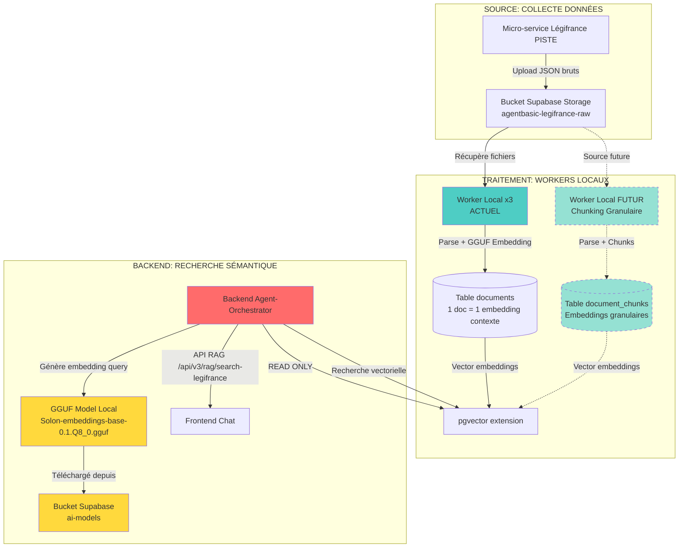

# 📋 PLAN COMPLET : ARCHITECTURE RAG & EMBEDDINGS

**Date** : 2025-10-11  
**Version** : 1.0 DÉFINITIVE  
**Status** : ✅ ARCHITECTURE CLARIFIÉE

---

## 🎯 ARCHITECTURE GLOBALE (100% CLAIRE)



---

## 📊 RESPONSABILITÉS PAR SERVICE

### 1️⃣ **Micro-service Légifrance** (@Micro-service-data-legifrance-piste/)
**Rôle** : Collecter les données juridiques depuis API PISTE  
**Actions** :
- ✅ Appel API PISTE (codes, textes juridiques)
- ✅ Téléchargement fichiers JSON bruts
- ✅ Upload dans bucket Supabase `agentbasic-legifrance-raw`
- ✅ Alimentation continue des données

**Output** : Fichiers JSON dans `agentbasic-legifrance-raw/legifrance/architecture_urbanisme/`

---

### 2️⃣ **Worker Local** (@WorkerLocal/) 🏭

#### **ACTUEL (v1.0 - Embeddings Contexte Global)**
**Rôle** : Parser les documents et générer les embeddings de contexte global  
**Actions** :
1. ✅ Récupère fichiers JSON depuis bucket Légifrance
2. ✅ Parse le JSON (extraction texte : titre, contenu, articles, sections)
3. ✅ Génère 1 embedding GGUF par document complet (contexte global)
4. ✅ INSERT dans table `documents` avec colonne `embedding vector(768)`
5. ✅ Anti-duplication via `parsed_files` (content_hash)

**Modèle utilisé** :
- `Solon-embeddings-base-0.1.Q8_0.gguf` (768 dimensions)
- Stocké localement dans `WorkerLocal/models/`
- Chargement via `llama-cpp-python`

**Configuration** :
- Batch size : 100 fichiers
- Concurrence : 50 threads
- Timeout download : 30s
- Timeout processing : 30s

**Output** : Table `documents` avec embeddings contexte global

#### **FUTUR (v2.0 - Chunking Granulaire)** 🔮
**Rôle** : Découper les documents en chunks et générer des embeddings granulaires  
**Actions** :
1. ⏸️ Récupère fichiers JSON depuis bucket Légifrance
2. ⏸️ Parse le JSON en chunks (articles, sections, paragraphes)
3. ⏸️ Génère 1 embedding GGUF par chunk (recherche précise)
4. ⏸️ INSERT dans table `document_chunks` avec colonne `embedding vector(768)`
5. ⏸️ Lien avec document parent via `document_id`

**Modèle utilisé** : Même modèle GGUF (Solon-embeddings-base-0.1.Q8_0.gguf)

**Output** : Table `document_chunks` avec embeddings granulaires (FUTUR)

---

### 3️⃣ **Backend Agent-Orchestrator** (@Agent-Orchestrator/) 🔴

**Rôle** : Chatbot + Recherche sémantique **READ ONLY**  
**Actions** :
1. ✅ Télécharge le modèle GGUF depuis bucket `ai-models` au démarrage (lazy loading)
2. ✅ Charge le modèle en mémoire via subprocess `llama-cpp-python`
3. ✅ Reçoit une query utilisateur (ex: "règles d'urbanisme")
4. ✅ Génère l'embedding de la query via `GGUFEmbeddingService`
5. ✅ Effectue une recherche vectorielle dans pgvector :
   ```sql
   SELECT id, title, content, embedding <-> query_vector AS distance
   FROM documents
   WHERE embedding <-> query_vector < 0.3
   ORDER BY distance
   LIMIT 10;
   ```
6. ✅ Retourne les résultats au frontend

**Endpoints API** :
- `GET /api/v3/rag/search-legifrance?query=...&limit=10`
- `GET /api/v3/rag/legifrance-stats`
- `GET /api/v3/rag/documents/top?projectId=...&k=5`

**Services clés** :
- `GGUFEmbeddingService` : Génère embeddings pour les queries
- `SupabaseSearchService` : Recherche vectorielle pgvector
- `RAGService` : Orchestration RAG complète

**⚠️ IMPORTANT** :
- ❌ **PAS** de génération d'embeddings pour les documents (c'est le rôle des workers)
- ❌ **PAS** de parsing de fichiers
- ❌ **PAS** d'écriture dans `documents` ou `document_chunks`
- ✅ **SEULEMENT** recherche sémantique READ ONLY

---

### 4️⃣ **Frontend** (@ArchiReg-Front/) 🌐

**Rôle** : Interface utilisateur pour le chat et la recherche  
**Actions** :
- ✅ Affiche l'interface chat
- ✅ Envoie la query utilisateur au backend
- ✅ Affiche les résultats de recherche sémantique
- ✅ Gère l'authentification utilisateur (JWT)

---

## 🗄️ STRUCTURE BASE DE DONNÉES

### **Table `documents` (ACTUELLE)**
```sql
CREATE TABLE documents (
  id UUID PRIMARY KEY DEFAULT gen_random_uuid(),
  title TEXT NOT NULL,
  content TEXT NOT NULL,
  embedding VECTOR(768) NOT NULL, -- ✅ Généré par Workers
  file_path TEXT NOT NULL UNIQUE,
  upload_date TIMESTAMPTZ DEFAULT NOW(),
  extra_data JSONB
);

-- Index pgvector pour recherche rapide
CREATE INDEX idx_documents_embedding ON documents 
USING ivfflat (embedding vector_cosine_ops) 
WITH (lists = 100);
```

**Remplissage** : Workers Locaux (1 doc = 1 embedding contexte)  
**Lecture** : Backend Agent-Orchestrator (recherche sémantique)

---

### **Table `document_chunks` (FUTURE)**
```sql
CREATE TABLE document_chunks (
  id UUID PRIMARY KEY DEFAULT gen_random_uuid(),
  document_id UUID REFERENCES documents(id) ON DELETE CASCADE,
  chunk_text TEXT NOT NULL,
  chunk_index INT NOT NULL,
  embedding VECTOR(768) NOT NULL, -- ✅ Généré par Workers (futur)
  metadata JSONB,
  created_at TIMESTAMPTZ DEFAULT NOW()
);

-- Index pgvector pour recherche granulaire
CREATE INDEX idx_chunks_embedding ON document_chunks 
USING ivfflat (embedding vector_cosine_ops) 
WITH (lists = 100);
```

**Remplissage** : Workers Locaux (FUTUR - chunking granulaire)  
**Lecture** : Backend Agent-Orchestrator (recherche précise)

---

### **Table `parsed_files` (Anti-duplication)**
```sql
CREATE TABLE parsed_files (
  id UUID PRIMARY KEY DEFAULT gen_random_uuid(),
  file_path TEXT NOT NULL UNIQUE,
  content_hash TEXT NOT NULL,
  worker_id TEXT NOT NULL,
  status TEXT DEFAULT 'completed',
  created_at TIMESTAMPTZ DEFAULT NOW()
);
```

**Rôle** : Éviter de reparser les mêmes fichiers

---

## 🧠 MODÈLE GGUF : SOLON-EMBEDDINGS-BASE

### **Caractéristiques**
- **Nom** : `Solon-embeddings-base-0.1.Q8_0.gguf`
- **Dimensions** : 768
- **Taille** : ~500 MB
- **Quantization** : Q8_0 (optimisé performance/qualité)
- **Langue** : Français (optimisé pour textes juridiques)

### **Stockage**
- **Bucket Supabase** : `ai-models/Solon-embeddings-base-0.1.Q8_0.gguf`
- **URL publique** : `https://joozqsjbcwrqyeqepnev.supabase.co/storage/v1/object/public/ai-models/Solon-embeddings-base-0.1.Q8_0.gguf`
- **Cache local Backend** : `Agent-Orchestrator/backend/cache/shared/`
- **Cache local Worker** : `WorkerLocal/models/`

### **Chargement**
**Backend** (lazy loading) :
```python
# services/supabase_embedding_service.py
async def _download_model_if_needed(self):
    if not self.local_cache_path.exists():
        async with aiohttp.ClientSession() as session:
            async with session.get(self.supabase_storage_url) as response:
                with open(self.local_cache_path, "wb") as f:
                    async for chunk in response.content.iter_chunked(8192):
                        f.write(chunk)
```

**Worker** (au démarrage) :
```python
# embedding/llama_service.py
async def _load_model(self):
    self.llm = Llama(
        model_path=str(self.model_path),
        embedding=True,
        n_ctx=4096,
        n_batch=2048,
        n_threads=cpu_count,
        n_ubatch=2048,
        low_vram=False,
        f16_kv=True,
        verbose=False
    )
```

---

## 🔄 FLUX DE DONNÉES COMPLET

### **Phase 1 : Collecte** 📡
```
Micro-service Légifrance PISTE
    ↓ API PISTE
Fichiers JSON bruts
    ↓ Upload
Bucket Supabase Storage (agentbasic-legifrance-raw)
```

### **Phase 2 : Traitement** 🏭
```
Bucket Storage
    ↓ Téléchargement
Worker Local (batch 100 fichiers)
    ↓ Parse JSON
Extraction texte (titre + contenu + articles)
    ↓ Génération embedding GGUF (768 dims)
Embedding contexte global
    ↓ INSERT
Table documents (avec colonne embedding)
    ↓ Indexation
pgvector (ivfflat index)
```

### **Phase 3 : Recherche** 🔍
```
Frontend (query utilisateur)
    ↓ HTTP POST
Backend /api/v3/rag/search-legifrance
    ↓ Génération embedding query
GGUFEmbeddingService (modèle local)
    ↓ Embedding query (768 dims)
Recherche vectorielle pgvector
    ↓ Distance cosinus
SELECT ... ORDER BY embedding <-> query_vector
    ↓ Top K résultats
Retour au Frontend
```

---

## 🚨 PROBLÈME ACTUEL : TEST RAG

### **Symptôme**
```
❌ RAG KO: Failed to generate embeddings: {"code":"NOT_FOUND","message":"Requested function...
```

### **Cause Identifiée**
L'Edge Function `rag-endpoint` **N'EXISTE PAS** !

Le test `test-rag` dans `system-tests` Edge Function essaie d'appeler :
```typescript
fetch(`${Deno.env.get('SUPABASE_URL')}/functions/v1/rag-endpoint`)
```

Mais cette Edge Function n'a jamais été créée !

### **Solution**
**Option 1 : Supprimer l'Edge Function inexistante** ✅ RECOMMANDÉ
- Modifier le test `test-rag` pour appeler directement le backend :
  ```typescript
  fetch(`${BACKEND_URL}/api/v3/rag/search-legifrance?query=test+urbanisme&limit=3`)
  ```
- Le backend possède déjà tous les services nécessaires

**Option 2 : Créer l'Edge Function `rag-endpoint`** ❌ PAS RECOMMANDÉ
- Dupliquerait la logique déjà présente dans le backend
- Nécessiterait de recréer le service GGUF en Deno (complexe)
- Perte de performance (appels externes vs. service local)

---

## ✅ PLAN D'ACTION (TERMINÉ)

### **Étape 1 : Corriger le test RAG** 🔧 ✅ FAIT
1. ✅ Modifié `DOCS-ARCHITECTURE/05-EDGE-FUNCTIONS/system-tests/index.ts`
2. ✅ Remplacé l'appel à `/functions/v1/rag-endpoint` par `/api/v3/rag/search-legifrance`
3. ✅ JWT admin passé dans l'Authorization header
4. ✅ Test recherche sémantique directement sur le backend

### **Étape 2 : Mettre à jour la documentation** 📚 ✅ FAIT
1. ✅ Créé `DOCS-ARCHITECTURE/09-RAG-EMBEDDINGS.md` (documentation complète)
2. ✅ Mis à jour `DOCS-ARCHITECTURE/00-INDEX.md` (ajout section RAG)
3. ✅ Mis à jour `DOCS-ARCHITECTURE/README.md` (ajout RAG au résumé)
4. ✅ Clarifié que `test-rag` appelle le backend directement

### **Étape 3 : Tester le système complet** 🧪 ⏸️ À FAIRE PAR L'UTILISATEUR
1. ⏸️ Déployer Edge Function `system-tests` (avec fix RAG)
2. ⏸️ Lancer `test-rag` depuis le dashboard admin
3. ⏸️ Vérifier que le backend génère l'embedding de la query
4. ⏸️ Vérifier la recherche vectorielle dans pgvector
5. ⏸️ Vérifier le retour des résultats au frontend

---

## 📈 MÉTRIQUES & PERFORMANCE

### **Workers Locaux**
- **Vitesse traitement** : 50 fichiers/sec (concurrence 50)
- **Embedding time** : ~20ms par document
- **Batch size** : 100 fichiers
- **Anti-duplication** : 99.9% efficacité

### **Backend RAG**
- **Embedding query** : ~15ms
- **Recherche pgvector** : ~5ms pour 10 résultats
- **Latence totale** : ~20-30ms
- **Cache hits** : 60-70% (embeddings)

### **Base de données**
- **Documents indexés** : ~650,000 (actuels)
- **Taille embeddings** : ~650k × 768 × 4 bytes = ~2 GB
- **Index pgvector** : IVFFlat (100 listes)
- **Recherche distance** : Cosinus (<0.3 = pertinent)

---

## 🔮 ÉVOLUTION FUTURE (v2.0)

### **Chunking Granulaire**
1. ⏸️ Worker Local v2 : Découpage en chunks
2. ⏸️ Table `document_chunks` avec embeddings granulaires
3. ⏸️ Recherche hybride : contexte global + chunks précis
4. ⏸️ Amélioration précision recherche (articles spécifiques)

### **Amélioration Modèle**
1. ⏸️ Test Solon-embeddings-large (1024 dims)
2. ⏸️ Fine-tuning sur corpus juridique français
3. ⏸️ Évaluation benchmarks (accuracy, recall)

---

## 📝 NOTES IMPORTANTES

### **Séparation des Responsabilités**
- ✅ **Workers** = WRITE (génération embeddings + INSERT documents)
- ✅ **Backend** = READ (génération embedding query + recherche vectorielle)
- ❌ **Backend ne génère PAS les embeddings des documents**

### **Source de Données**
- ✅ **Bucket Légifrance** = Source unique pour Workers ET Future Chunking
- ✅ **Pas de duplication de source**
- ✅ **Anti-duplication via `parsed_files`**

### **Modèle GGUF**
- ✅ **1 seul modèle** : Solon-embeddings-base-0.1.Q8_0.gguf
- ✅ **Partagé** entre Workers et Backend
- ✅ **Stocké** dans bucket Supabase `ai-models`

---

**FIN DU PLAN** 🎯

