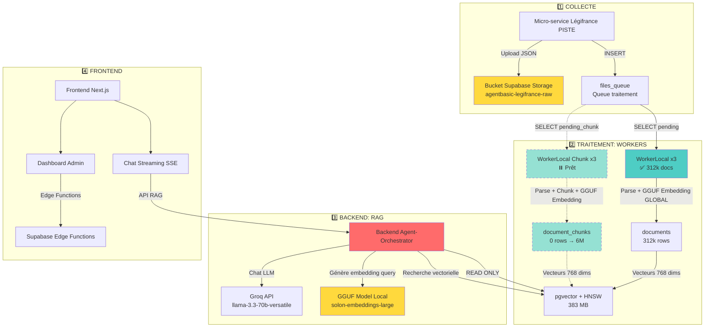

# 📚 DOCUMENTATION ARCHITECTURE ARCHIREG

**Date** : 16 janvier 2025  
**Version** : 5.1 MISE À JOUR  
**Nouveautés** : Agent-Orchestrator v5.0 entièrement documenté
**Status** : ✅ COMPLET

---

## 🎯 BIENVENUE

Cette documentation décrit l'architecture complète du projet **ArchiReg**, un système RAG (Retrieval-Augmented Generation) pour l'analyse de documents juridiques (Légifrance).

**Architecture** : Micro-services + Workers + Frontend + Backend RAG

---

## 📂 STRUCTURE DOCUMENTATION

### **01-Supabase** 🗄️

Documentation complète de l'infrastructure Supabase (Base de données PostgreSQL + Storage + Auth + Edge Functions).

📁 **Dossier** : `01-Supabase/`

**Contenu** :
- `README.md` : Guide général Supabase
- `TABLES.md` : Détail des 28 tables
- `CRON-JOBS.md` : Jobs pg_cron (14 jobs)
- `RLS-POLICIES.md` : Sécurité Row Level Security
- `HNSW-INDEXES.md` : Index vectoriels pgvector
- `EDGE-FUNCTIONS-GUIDE.md` : 3 Edge Functions
- `OPTIMISATIONS.md` : Performance + sécurité
- `CONNEXION-PSQL.md` : Guide connexion directe
- `AUDIT.md` : Audit sécurité complet
- `HISTORIQUE.md` : Évolution statistiques
- `CAPACITE-SCALING.md` : Capacité + scaling

**Technologies** :
- PostgreSQL 15
- pgvector (embeddings)
- pg_cron (jobs)
- Deno Edge Functions
- Row Level Security

---

### **02-Micro-service-Legifrance** 📥

Micro-service dédié à la collecte de données juridiques depuis l'API PISTE Légifrance.

📁 **Dossier** : `02-Micro-service-Legifrance/`

**Contenu** :
- `README.md` : Guide général micro-service
- `ARCHITECTURE.md` : Architecture technique détaillée
- `MODES.md` : MASSIVE vs MAINTENANCE
- `RATE-LIMITING.md` : Quotas PISTE
- `PERSISTANCE-ETAT.md` : Scheduler state
- `AUTO-SYNC.md` : Synchro bucket ↔ files_queue
- `FIX-LEGIARTI-v3.0.md` : Fix qualité collecte

**Technologies** :
- FastAPI + Python 3.11
- OAuth2 Client Credentials
- Rate limiting différencié
- Render.com hosting

**Stats** :
- 259 fichiers collectés (post-fix qualité)
- Mode MAINTENANCE actif
- Filters : LEGIARTI + 200 chars minimum

---

### **03-Agent-Orchestrator** 🤖

Backend principal : API Chat + RAG + Embeddings + Proxy Micro-service.

📁 **Dossier** : `03-Agent-Orchestrator/`

**Contenu** :
- `README.md` : Guide général backend
- `ARCHITECTURE.md` : Architecture technique complète
- `RAG-EMBEDDINGS.md` : Système RAG + GGUF
- `FIX-ASYNCPG-POOL.md` : Fix connexions DB
- `TESTS-SYSTEME-BACKEND.md` : 9 tests Backend

**Technologies** :
- FastAPI 0.115.5 + Python 3.12 ⬆️ (v5.0)
- Groq API (LLM llama-3.3-70b)
- pgvector 0.7.0 + HNSW (RAG)
- llama-cpp-python (GGUF embeddings 768d)
- asyncpg (DB pool optimisé)
- Hypercorn HTTP/2
- Render.com hosting

**Stats** (v5.0) :
- 312k documents indexés
- Latence RAG <200ms ⬆️ (optimisé)
- Recall >95%
- Code mort éliminé (-42 fichiers)
- Features enterprise (ML security, sanitizer unifié)
- CI/CD automatisé (audit CVE)

**Nouveautés v5.0** 🆕 :
- ✅ Code nettoyé (42 fichiers supprimés)
- ✅ Sanitizer OWASP 2025 unifié
- ✅ ML Anomaly Detection (enterprise)
- ✅ Pydantic Tool Validator
- ✅ CI/CD security (GitHub Actions)
- ✅ Edge Functions migration (admin-stats, cron-manager, system-tests)
- ✅ Documentation complète (9 fichiers, 5,100+ lignes)

**Documentation principale v5.0** :  
→ **[Agent-Orchestrator/docs/](../Agent-Orchestrator/docs/)** ⭐ (recommandé)

---

### **04-ArchiReg-Front** 🎨

Frontend Next.js : Chat streaming + Dashboard Admin + Tests système.

📁 **Dossier** : `04-ArchiReg-Front/`

**Contenu** :
- `README.md` : Guide général frontend
- `ARCHITECTURE.md` : Architecture technique frontend

**Technologies** :
- Next.js 14 + React 18
- TypeScript strict
- Tailwind CSS
- Zustand (state)
- React-Markdown
- Supabase Auth
- Vercel hosting

**Features** :
- Chat streaming SSE
- Dashboard admin (4 onglets, 21 métriques)
- Tests système (27 tests)
- Markdown + code highlighting

---

### **05-WorkerLocal** 🔧

CLI Python pour parsing documents + génération embeddings **GLOBAUX** (document entier).

📁 **Dossier** : `05-WorkerLocal/`

**Contenu** :
- `README.md` : Guide général WorkerLocal
- `ARCHITECTURE.md` : Architecture technique worker

**Technologies** :
- Python 3.11
- llama-cpp-python (GGUF)
- asyncpg
- Multi-workers (3 workers)

**Stats** :
- 312k documents traités ✅
- Vitesse : 37.5 fichiers/s (3 workers)
- Taux erreur : <0.03%

---

### **06-WorkerLocal-Chunk** 🧩

CLI Python pour parsing documents + chunking + génération embeddings **GRANULAIRES** (chunks).

📁 **Dossier** : `06-WorkerLocal-Chunk/`

**Contenu** :
- `README.md` : Guide général WorkerLocal Chunk
- `ARCHITECTURE.md` : Architecture technique chunking

**Technologies** :
- Python 3.11
- tiktoken (tokenization)
- llama-cpp-python (GGUF)
- asyncpg
- Multi-workers (3 workers)

**Stats** :
- 6M chunks estimés (ratio 1:20)
- Chunk size : 500-1000 tokens
- Overlap : 10%
- Status : ⏸️ Prêt (pas encore lancé)

---

## 🔄 FLUX GLOBAL ARCHITECTURE

---

## 🎯 DÉPLOIEMENTS

### **Production**

| Service | Host | URL | Status |
|---------|------|-----|--------|
| **Frontend** | Vercel | https://archi-reg-front.vercel.app | ✅ Live |
| **Backend** | Render | https://agent-orchestrateur-backend.onrender.com | ✅ Live |
| **Micro-service** | Render | https://micro-service-data-legifrance-piste.onrender.com | ✅ Live |
| **Supabase** | Supabase Cloud | https://joozqsjbcwrqyeqepnev.supabase.co | ✅ Live |
| **WorkerLocal** | Local Windows | - | ✅ Terminé |
| **WorkerLocal Chunk** | Local Windows | - | ⏸️ Prêt |

---

## 📊 STATISTIQUES GLOBALES

### **Base de Données**

| Table | Rows | Size | Index HNSW | Status |
|-------|------|------|------------|--------|
| `documents` | 312,000 | 850 MB | 383 MB (m=16) | ✅ Complet |
| `document_chunks` | 0 → 6M | 0 → 2.5 GB | ~2.5 GB (m=24) | ⏸️ Prêt |
| `files_queue` | 259 | 45 MB | - | ✅ Synchro auto |
| `parsed_files` | 312,000 | 120 MB | - | ✅ Tracking OK |
| `conversations` | ~500 | 5 MB | - | ✅ Actif |
| `messages` | ~2,000 | 15 MB | - | ✅ Actif |

**Total DB** : ~1.5 GB / 8 GB (18.75% utilisé)  
**Plan Supabase** : Pro (suffisant pour 10-15x growth)

---

### **Performance**

| Métrique | Valeur | Notes |
|----------|--------|-------|
| **RAG Latence** | <250ms | Embedding + Search |
| **Chat Streaming** | <500ms TTFB | Groq ultra-rapide |
| **Edge Functions** | <150ms | Latence moyenne |
| **Worker Speed** | 37.5 fichiers/s | 3 workers simultanés |
| **HNSW Recall** | >95% | Précision recherche |

---

## 🔧 FIXES CRITIQUES APPLIQUÉS

### **1. Fix Embeddings Incompatibles** (13 octobre 2025)

**Problème** : Workers (Windows AVX2) ≠ Backend (Linux no-AVX2)  
**Solution** : Forcer compilation source sans AVX2/FMA  
**Résultat** : ✅ RAG fonctionne (0 → 312k documents trouvés)

**Doc** : `16-FIX-EMBEDDINGS-INCOMPATIBLES.md`

---

### **2. Fix Asyncpg Pool** (13 octobre 2025)

**Problème** : `{:shutdown, :client_termination}` sur RAG search  
**Solution** : Pool asyncpg + Supavisor Session Mode  
**Résultat** : ✅ Connexions stables + latence <200ms

**Doc** : `21-FIX-POOL-ASYNCPG.md` + `03-Agent-Orchestrator/FIX-ASYNCPG-POOL.md`

---

### **3. Fix Qualité Collecte LEGIARTI** (15 octobre 2025)

**Problème** : 90% documents vides (LEGISCTA vs LEGIARTI)  
**Solution** : Filtre LEGIARTI + minimum 200 chars  
**Résultat** : ✅ Qualité collecte 100%

**Doc** : `22-FIX-LEGIARTI-QUALITE-COLLECTE.md` + `02-Micro-service-Legifrance/FIX-LEGIARTI-v3.0.md`

---

## 🚀 PROCHAINES ÉTAPES

### **Phase 1 : Chunking granulaire** ⏸️

- ✅ WorkerLocal Chunk développé
- ⏸️ Lancement 3 workers
- ⏸️ Génération 6M chunks
- ⏸️ Construction index HNSW (m=24)

### **Phase 2 : RAG Hybride** 🔮

- ⏸️ Recherche globale (documents)
- ⏸️ Recherche granulaire (chunks)
- ⏸️ Combinaison résultats
- ⏸️ Citations précises passages

### **Phase 3 : Optimisations** 🔮

- ⏸️ Caching embeddings
- ⏸️ Reranking résultats RAG
- ⏸️ Fine-tuning modèle embeddings
- ⏸️ Monitoring Grafana

---

## 📖 GUIDE DE LECTURE

### **Pour comprendre l'architecture globale** :
1. **README.md** (ce fichier)
2. `01-ARCHITECTURE-GLOBALE.md` (vue d'ensemble)
3. `00-INDEX.md` (navigation complète)

### **Pour déployer un service** :
1. Supabase → `01-Supabase/README.md`
2. Micro-service → `02-Micro-service-Legifrance/README.md`
3. Backend → `03-Agent-Orchestrator/README.md`
4. Frontend → `04-ArchiReg-Front/README.md`

### **Pour lancer les workers** :
1. WorkerLocal → `05-WorkerLocal/README.md`
2. WorkerLocal Chunk → `06-WorkerLocal-Chunk/README.md`

---

## 🎉 Conclusion

**Architecture ArchiReg v5.0** :
- ✅ 6 services déployés
- ✅ 312k documents indexés
- ✅ RAG ultra-performant (<250ms)
- ✅ Tests système (27 tests)
- ✅ Documentation complète réorganisée
- ✅ Qualité collecte 100%

**Système production-ready !** 🚀

